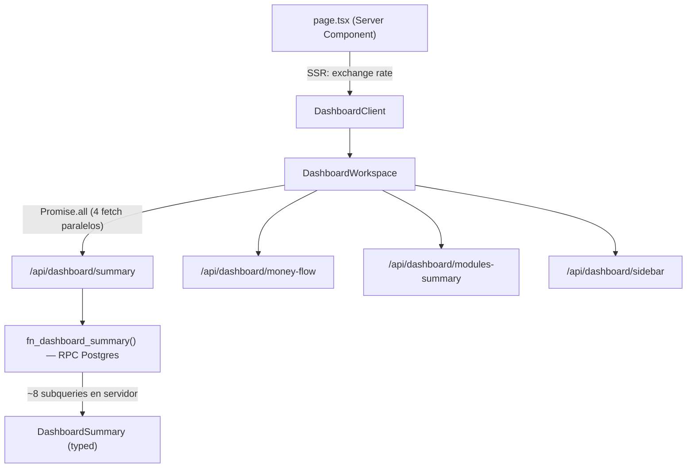

# DASHBOARD REDESIGN AUDIT — FinTrack

> **Fase 1 obligatoria** — documento de diagnóstico previo al rediseño.
> Ninguna línea de código se toca hasta que este documento sea aprobado.

---

## 1. Arquitectura actual del dashboard

### 1.1 Flujo de datos



- **SSR mínimo**: solo tipo de cambio. El resto es client-side con SWR.
- **4 endpoints en paralelo**: `summary`, `money-flow`, `modules-summary`, `sidebar`.
- **1 RPC consolidado** (`fn_dashboard_summary`) que ejecuta ~8 subqueries.
- **SWR con dedup de 30s** en todos los widgets — correcto, evita refetch innecesario.

### 1.2 Estructura de archivos

| Archivo | Rol | Líneas |
|---------|-----|--------|
| [page.tsx](file:///Users/eliasgustavopacopauccara/Documents/Fintrack_v1/fintrack/app/(dashboard)/dashboard/page.tsx) | Server Component, metadata, revalidate 60s | 32 |
| [DashboardWorkspace.tsx](file:///Users/eliasgustavopacopauccara/Documents/Fintrack_v1/fintrack/components/dashboard/DashboardWorkspace.tsx) | Orquestador: fetch paralelo, layout grid 12-col, skeleton, error | 256 |
| [DashboardHeader.tsx](file:///Users/eliasgustavopacopauccara/Documents/Fintrack_v1/fintrack/components/dashboard/DashboardHeader.tsx) | Hero card: balance, resultado, sparkline, KPIs laterales | 255 |
| [MoneyFlowChart.tsx](file:///Users/eliasgustavopacopauccara/Documents/Fintrack_v1/fintrack/components/dashboard/MoneyFlowChart.tsx) | Gráfico principal de flujo (acumulado / mensual) | 211 |
| [SaldosDiaChart.tsx](file:///Users/eliasgustavopacopauccara/Documents/Fintrack_v1/fintrack/components/dashboard/SaldosDiaChart.tsx) | Saldos por día con selector de período (5D-1A) | 200 |
| [FinancialHealthScore.tsx](file:///Users/eliasgustavopacopauccara/Documents/Fintrack_v1/fintrack/components/dashboard/FinancialHealthScore.tsx) | Score compuesto radial + 4 factores con barras | 224 |
| [FlujoPendienteWidget.tsx](file:///Users/eliasgustavopacopauccara/Documents/Fintrack_v1/fintrack/components/dashboard/FlujoPendienteWidget.tsx) | Neto por cobrar vs por pagar + top 3 contrapartes | 171 |
| [VencimientosWidget.tsx](file:///Users/eliasgustavopacopauccara/Documents/Fintrack_v1/fintrack/components/dashboard/VencimientosWidget.tsx) | Timeline de vencimientos con badges de urgencia | 175 |
| [EgresosCategoriasWidget.tsx](file:///Users/eliasgustavopacopauccara/Documents/Fintrack_v1/fintrack/components/dashboard/EgresosCategoriasWidget.tsx) | Donut + barras por categoría (egresos/ingresos) | 180 |
| [SavingsRateTrendChart.tsx](file:///Users/eliasgustavopacopauccara/Documents/Fintrack_v1/fintrack/components/dashboard/SavingsRateTrendChart.tsx) | Tendencia tasa de ahorro (6m) | 144 |
| [DailyBalanceDeltaChart.tsx](file:///Users/eliasgustavopacopauccara/Documents/Fintrack_v1/fintrack/components/dashboard/DailyBalanceDeltaChart.tsx) | Barras de variación diaria (1M) | 149 |
| [TopCategoriesWidget.tsx](file:///Users/eliasgustavopacopauccara/Documents/Fintrack_v1/fintrack/components/dashboard/TopCategoriesWidget.tsx) | Ranking top 5 categorías de gasto | 104 |
| [MetricCards.tsx](file:///Users/eliasgustavopacopauccara/Documents/Fintrack_v1/fintrack/components/dashboard/MetricCards.tsx) | 4 cards: Patrimonio, Ingresos, Egresos, Balance | 78 |
| [SaldosBancariosWidget.tsx](file:///Users/eliasgustavopacopauccara/Documents/Fintrack_v1/fintrack/components/dashboard/SaldosBancariosWidget.tsx) | Lista de portafolios con barras de distribución | 85 |
| [PresupuestosMesWidget.tsx](file:///Users/eliasgustavopacopauccara/Documents/Fintrack_v1/fintrack/components/dashboard/PresupuestosMesWidget.tsx) | Presupuestos del mes: definido vs ejecutado + detalle | 211 |
| [CreditosUsoRapidoWidget.tsx](file:///Users/eliasgustavopacopauccara/Documents/Fintrack_v1/fintrack/components/dashboard/CreditosUsoRapidoWidget.tsx) | Créditos: cupo total/usado + utilización | 100 |
| [ModulesMiniCards.tsx](file:///Users/eliasgustavopacopauccara/Documents/Fintrack_v1/fintrack/components/dashboard/ModulesMiniCards.tsx) | 4 mini-cards resumen (Cuentas, Créditos, Activos, Por cobrar/pagar) | 90 |

### 1.3 Layout grid actual

```
┌─────────────────────────┬──────────────┐
│  DashboardHeader (8col) │  Flujo (4col)│
│  Balance + Sparkline    │  Pendiente   │
│                         │  Vencimientos│
├──────────────────┬──────┴──────────────┤
│ MoneyFlow (7col) │ HealthScore (5col)  │
├──────────────────┼─────────────────────┤
│ SaldosDia (7col) │ EgresosCat (5col)   │
├──────────┬───────┼──────┬──────────────┤
│Savings(4)│Delta(4)│TopCat(4)           │
├──────────┴───────┼──────┴──────────────┤
│ MetricCards(7col) │ SaldosBanc (5col)  │
├──────────────────┼─────────────────────┤
│ Presupuestos(7)  │ CreditosUso (5col) │
├──────────────────┴─────────────────────┤
│ ModulesMiniCards (12col)               │
└────────────────────────────────────────┘
```

**Total: 16 widgets** en una sola página de scroll largo.

---

## 2. Mapa de datos por módulo

> Cada módulo de la app y qué datos expone al dashboard.

| Módulo | Datos disponibles en dashboard | Endpoint / origen |
|--------|-------------------------------|-------------------|
| **Portafolio / Cuentas** | Saldos por cuenta, total consolidado PEN/USD, cantidad de cuentas | `summary.accounts`, `sidebar.saldos_bancarios`, `modules.cuentas*` |
| **Transacciones** | Ingresos/egresos del mes, flujo mensual 6m, flujo diario (5D–1A), categorías de gasto/ingreso | `summary.ingresos/egresos`, `money-flow`, `sidebar.egresos_categoria` |
| **Créditos** | Cupo total, cupo usado, % utilización, líneas activas, próximo cierre | `modules.creditos*`, `summary.credits[]` |
| **Presupuestos** | Presupuestos activos, monto definido vs ejecutado, % progreso, over_limit | `/api/budget-periods` (fetch directo) |
| **Por Cobrar** | Total pendiente PEN/USD, count, top 3 deudores con monto | `sidebar.flujo_pendiente.por_cobrar*`, `modules.por_cobrar` |
| **Por Pagar** | Total pendiente PEN/USD, count, top 3 acreedores con monto | `sidebar.flujo_pendiente.por_pagar*`, `modules.por_pagar` |
| **Recurrentes** | ⚠️ **NO integrado** — el dashboard no muestra datos de recurrentes | N/A |
| **Alertas** | Solo conteo (`alertas_pendientes`), sin detalle ni lista | `summary.alertas_pendientes` |
| **Activos** | Total valor PEN/USD, conteo, distribución por tipo | `modules.activos.*` |

> [!WARNING]
> **Recurrentes** tiene ruta (`/recurring`) y módulo (`/modules/shared`) pero el dashboard NO integra proyección de gastos recurrentes futuros.
> **Alertas** solo muestra un número en la hero card, sin desglose ni priorización.

---

## 3. Diagnóstico del dashboard actual

### 3.1 Problemas de jerarquía de información

| # | Problema | Severidad | Detalle |
|---|----------|-----------|---------|
| H1 | **El hero card intenta mostrar todo** | 🔴 Crítico | Balance consolidado, resultado mensual, variación vs mes anterior, sparkline 6m, ingresos del mes, egresos del mes, y alertas pendientes — todo en un solo componente. Demasiada densidad sin jerarquía clara. |
| H2 | **Información financiera repetida** | 🟠 Alto | Ingresos y egresos aparecen en: (1) HeroStat dentro del Header, (2) MetricCards, (3) SaldosDiaChart totals, (4) tooltip de MoneyFlowChart. Cuatro lugares diferentes para el mismo dato. |
| H3 | **MetricCards está enterrado** | 🟠 Alto | El patrimonio neto — posiblemente el KPI más importante — está en la fila 5 del dashboard. El usuario tiene que hacer scroll largo para llegar a él. |
| H4 | **ModulesMiniCards redundante** | 🟡 Medio | Las 4 mini-cards al final replican datos que ya se muestran más arriba (cuentas = saldos bancarios, créditos = CreditosUsoRapido, etc.). Es un footer informativo que no agrega valor. |
| H5 | **Flujo pendiente demasiado temprano** | 🟡 Medio | Ocupa posición premium (columna derecha del hero) pero solo es relevante si el usuario usa activamente por cobrar/por pagar. Para usuarios sin esas funciones, son 2 cards vacías en zona prime. |

### 3.2 Gráficos vacíos, rotos o poco legibles

| # | Widget | Problema | Severidad |
|---|--------|----------|-----------|
| G1 | **SaldosDiaChart** | ⚠️ Con pocas transacciones, la línea es flat y el gradiente no comunica nada. La línea de promedio se superpone a la curva real. Bajo contraste entre `--c-accent-landing` y el fondo en light mode. | 🟠 Alto |
| G2 | **EgresosCategoriasWidget (Donut)** | ⚠️ Si el usuario tiene 1 sola categoría, el donut se muestra como un anillo completo de un solo color — no comunica distribución. Con 2 categorías donde una domina el 95%, el segmento menor es invisible. | 🟠 Alto |
| G3 | **DailyBalanceDeltaChart** | ⚠️ Barras de 10px de ancho con 30 días = barras demasiado delgadas y difíciles de interactuar. Las etiquetas del eje X se superponen en mobile. | 🟡 Medio |
| G4 | **SavingsRateTrendChart** | ⚠️ Solo 6 puntos de datos. La línea de referencia a 20% se ve bien, pero con un solo mes de datos el chart aparece como un punto aislado — no tendencia. | 🟡 Medio |
| G5 | **BalanceSparkline (Hero)** | ⚠️ Empty state dice "La tendencia aparecerá cuando haya datos suficientes" — no ofrece acción ni contexto de qué hacer. | 🟡 Medio |
| G6 | **MoneyFlowChart** | ✅ Funciona bien en ambos modos. Las líneas auxiliares de ingresos/egresos en modo mensual son un buen detalle. Tooltip informativo. | ✅ OK |

### 3.3 Empty states deficientes

| Widget | Estado vacío actual | Problema |
|--------|-------------------|----------|
| FlujoPendienteWidget | "Sin contrapartes destacadas en este período." | No indica cómo crear una contraparte ni por qué es útil |
| VencimientosWidget | "No hay vencimientos en los próximos 30 días." | ✅ Aceptable |
| EgresosCategoriasWidget | "Sin egresos en el período actual." | No ofrece call to action |
| TopCategoriesWidget | "Todavía no hay gasto suficiente para construir el ranking." | ✅ Aceptable |
| SaldosBancariosWidget | "No hay saldos disponibles para mostrar." | Genérico, no indica cómo empezar |
| PresupuestosMesWidget | "No hay presupuestos activos para la fecha actual." | No enlaza a crear presupuesto |

### 3.4 Inconsistencias de tokens CSS

| # | Problema | Severidad |
|---|----------|-----------|
| T1 | **Doble sistema de tokens activo** | 🟠 Alto | Algunos widgets usan `--ft-*` (FlujoPendiente, VencimientosWidget, EgresosCategoriasWidget, PresupuestosMesWidget, CreditosUsoRapido) y otros usan `--c-*` aliases (DashboardHeader parcialmente, primitives.tsx, MoneyFlowChart). El Header mezcla ambos en el mismo archivo. |
| T2 | **Colores hardcodeados en primitives.tsx** | 🟡 Medio | `KpiCard` usa `'#C14554'` y `'#B88435'` y `'#3F68A7'` directamente en lugar de `var(--ft-danger)`, `var(--ft-warning)`, `var(--ft-info)`. |
| T3 | **chartTheme usa `--c-*` exclusivamente** | 🟡 Medio | `chartTheme.ts` referencia `--c-*` (los aliases). Funciona porque `--c-primary: var(--ft-primary)`, pero crea confusión de cuál es el sistema canónico. |

---

## 4. Lo que falta: gaps críticos

### 4.1 Proyección de flujo de caja futuro

> [!CAUTION]
> **Gap crítico**: El dashboard muestra solo datos históricos. No hay proyección forward-looking.

El sistema tiene todos los datos necesarios:
- **Recurrentes** (gastos e ingresos programados con frecuencia)
- **Por Cobrar** (ingresos esperados con fecha de vencimiento)
- **Por Pagar** (egresos esperados con fecha de vencimiento)
- **Cuotas de créditos** (vencimientos con monto y fecha)

Pero ningún widget proyecta "¿cómo se verá mi flujo en los próximos 30/60/90 días?". Este es probablemente el dato más valioso que un dashboard financiero personal puede ofrecer.

### 4.2 Salud financiera como score visual real

El `FinancialHealthScore` actual tiene buena lógica de scoring (savings rate × 1.4, credit score, alert penalty, pending score) y un buen `RadialBarChart`, **pero**:

- Los 4 factores son barras de progreso independientes que no se leen como un sistema integrado.
- No hay indicación de qué acción tomar para mejorar el score.
- El score no tiene contexto histórico ("tu score subió/bajó X puntos desde el mes pasado").
- Falta la dimensión de **diversificación** de activos y la **ratio de endeudamiento** (deuda total / patrimonio).

### 4.3 Comparativo presupuesto vs gasto real por categoría

`PresupuestosMesWidget` muestra presupuestos con progreso, pero:

- No cruza presupuestos con categorías de gasto del donut.
- No permite ver "definí S/500 en Alimentación, gasté S/380" lado a lado con las demás categorías.
- No hay timeline de ejecución (cómo avanza el gasto vs el presupuesto a lo largo del mes).

### 4.4 Vista consolidada de créditos

`CreditosUsoRapidoWidget` muestra cupo total/usado/utilización, pero:

- No muestra las líneas individuales (solo el agregado).
- No muestra próximos vencimientos de ciclo de tarjeta / cuotas (eso está en VencimientosWidget, no asociado visualmente a créditos).
- No hay indicador visual de qué tarjeta/línea tiene más presión.

### 4.5 Integración de Recurrentes

- El módulo existe (`/recurring`, API `/api/recurring`) pero el dashboard no consume NADA de él.
- Debería alimentar la proyección de flujo futuro (§4.1).
- Debería indicar "tienes X gastos recurrentes programados este mes por un total de S/Y".

### 4.6 Alertas con contexto

- Actualmente solo `alertas_pendientes: number` en el HeroStat.
- Existe [AlertsWidget.tsx](file:///Users/eliasgustavopacopauccara/Documents/Fintrack_v1/fintrack/components/dashboard/widgets/AlertsWidget.tsx) en `widgets/` pero **no está integrado** en el layout del dashboard.
- Las alertas deberían ser la **primera cosa visible** si hay alguna crítica (cuotas vencidas, presupuestos excedidos).

---

## 5. Inventario de primitivos reutilizables

### 5.1 Dashboard primitives ([primitives.tsx](file:///Users/eliasgustavopacopauccara/Documents/Fintrack_v1/fintrack/components/dashboard/primitives.tsx))

| Primitivo | Uso actual | Reutilizable |
|-----------|-----------|--------------|
| `WidgetShell` | Wrapper con PremiumCard, maneja padding | ✅ Sí |
| `SectionHeader` | Título + acción + dot de acento | ✅ Sí |
| `KpiCard` | Card con label/value/change/trend/icon | ✅ Sí, pero con colores hardcodeados |
| `MoneyRow` | Fila de listado con label/amount/badge | ✅ Sí |
| `UrgencyBadge` | Badge de urgencia (Vencida/Esta semana/Próxima) | ✅ Sí |
| `EmptyWidget` | Estado vacío genérico con icono/mensaje/hint | ✅ Sí |
| `ProgressBar` | Barra de progreso simple | ✅ Sí |

### 5.2 Finance primitives ([finance/primitives.tsx](file:///Users/eliasgustavopacopauccara/Documents/Fintrack_v1/fintrack/components/finance/primitives.tsx))

| Primitivo | Uso actual | Reutilizable |
|-----------|-----------|--------------|
| `PageLayout` | Layout general de página con header/stats/controls/children | ✅ Sí |
| `RegisterModule` | Módulo completo con eyebrow/title/description/actions | ✅ Sí |
| `ModuleHeader` | Header de módulo con 3 modos (full/content/hidden) | ✅ Sí |
| `StatGrid` | Grid responsive de 1–4 columnas | ✅ Sí |
| `StatCard` | Card de estadística con tone/icon/detail/caption | ✅ Sí |
| `ControlsBar` | Barra de controles con presets/search/filters/actions | ✅ Sí |
| `StatusBadge` | Badge de estado con tone system (6 tonos + muted) | ✅ Sí |
| `AmountCell` | Celda de monto con label/meta/alignment | ✅ Sí |
| `ProgressMetric` | Barra de progreso con label/description/tone | ✅ Sí, ya usada en Presupuestos y Créditos |
| `EmptyState` | Estado vacío completo con icon/title/description/action | ✅ Sí |
| `ConfirmDialog` | Modal de confirmación con loading/danger | ✅ Sí |
| `DetailDrawer` | Panel lateral deslizable con header/content/footer | ✅ Sí |

### 5.3 Shared components

| Componente | Ruta | Uso |
|-----------|------|-----|
| `PremiumCard` | [PremiumCard.tsx](file:///Users/eliasgustavopacopauccara/Documents/Fintrack_v1/fintrack/components/dashboard/PremiumCard.tsx) | Double-bezel card (outer shell + inner core) — usado por todos los widgets |
| `SmartTip` | [SmartTip.tsx](file:///Users/eliasgustavopacopauccara/Documents/Fintrack_v1/fintrack/components/dashboard/SmartTip.tsx) | Tooltip contextual |
| `chartTheme` | [chartTheme.ts](file:///Users/eliasgustavopacopauccara/Documents/Fintrack_v1/fintrack/components/dashboard/chartTheme.ts) | Tokens compartidos para Recharts |

---

## 6. Widgets no integrados (existen pero no se usan)

Dentro de [widgets/](file:///Users/eliasgustavopacopauccara/Documents/Fintrack_v1/fintrack/components/dashboard/widgets) existen componentes que **NO están montados** en `DashboardWorkspace`:

| Archivo | Descripción | Líneas |
|---------|-------------|--------|
| `AlertsWidget.tsx` | Widget completo de alertas con lista detallada | 9,414 bytes |
| `CashFlowChart.tsx` | Gráfico de flujo de caja alternativo (más completo) | 12,881 bytes |
| `ExpenseBreakdown.tsx` | Desglose de gastos alternativo | 6,014 bytes |
| `FinanceWidgets.tsx` | Colección de widgets financieros | 11,355 bytes |
| `ReceivablesPayablesWidget.tsx` | Widget consolidado de por cobrar/pagar | 7,516 bytes |

> [!NOTE]
> Estos componentes pueden tener lógica reutilizable. Antes del rediseño, se deben auditar para extraer lo que sirva.

---

## 7. Resumen de hallazgos

### Lo que funciona bien ✅
1. **PremiumCard con double-bezel** — da profundidad y calidad visual consistente.
2. **Sistema de tokens `--ft-*`** — completo con light/dark y aliases de compatibilidad.
3. **SWR con fallback + dedup** — patrón de fetching eficiente y resiliente.
4. **Skeleton loaders** — cada widget tiene loading state con forma coherente.
5. **MoneyFlowChart** — toggle acumulado/mensual es un buen patrón de interacción.
6. **VencimientosWidget** — timeline con urgencia visual clara y links actionables.
7. **Tone system** en primitivos — `primary/success/warning/danger/info/neutral` bien definido.
8. **Dashboard enter animations** — `dashboard-enter` con delays escalonados da una entrada suave.

### Lo que necesita cirugía 🔧
1. **16 widgets en scroll vertical** — demasiado largo, sin agrupación temática.
2. **Jerarquía plana** — todo tiene el mismo peso visual (PremiumCard idéntica para todos).
3. **Redundancia de datos** — ingresos/egresos aparece en 4 lugares diferentes.
4. **No hay proyección de futuro** — solo datos históricos.
5. **Alertas es solo un número** — sin lista, sin priorización, sin acción.
6. **Recurrentes no integrado** — módulo existe pero el dashboard lo ignora.
7. **Donut con 1 categoría** — chart visualization breaks con datos escasos.
8. **Tokens mixtos `--c-*` / `--ft-*`** — confusión de sistema canónico.
9. **Colores hardcodeados en KpiCard** — `#C14554`, `#B88435`, `#3F68A7`.
10. **Empty states genéricos** — no ofrecen call to action ni guían al usuario.

### Regla de negocio confirmada ✅
- **Por Cobrar genera tipo EXPENSE** (lo que me deben, al cobrarlo no es ingreso sino reducción de deuda)
- **Por Pagar genera tipo INCOME** (lo que debo, al pagarlo no es egreso sino cumplimiento de obligación)
- Moneda base: **Soles (PEN)** con equivalencia en **USD**.

---

> **Próximo paso**: una vez aprobada esta auditoría, procedo con `DASHBOARD_REDESIGN_PROPOSAL.md` con la arquitectura de información, sistema de gráficos, responsive, y microinteracciones.
