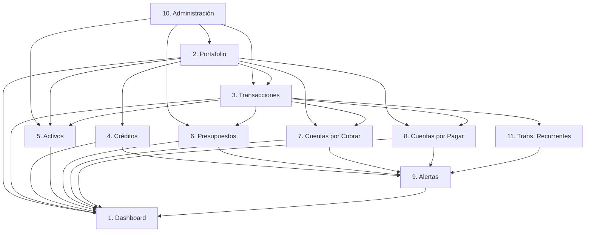

# FASE 1 — ANÁLISIS DEL PRD v1.9.119.1.1

> [!NOTE]
> Análisis basado en la lectura completa del PRD (`docs/fintrack-prd-v3.md`) y la auditoría del código fuente actual en el workspace.

---

## 1. Lista de Módulos — Estado Actual vs PRD

### Resumen Rápido

| # | Módulo | Estado | Ruta App | Componente Principal | Nivel de Trabajo |
|---|--------|--------|----------|---------------------|-----------------|
| 1 | Dashboard | ✅ Existe | `app/(dashboard)/dashboard` | `modules/dashboard/` | 🟡 Mejoras significativas |
| 2 | Portafolio | ✅ Existe | `app/(dashboard)/portfolio` | `components/management/PortfolioManager.tsx` | 🟡 Mejoras medias |
| 3 | Transacciones | ✅ Existe | `app/(dashboard)/transactions` | `components/transactions/`, `modules/transactions/` | 🟠 Mejoras grandes |
| 4 | Créditos | ✅ Existe | `app/(dashboard)/credits` | `components/management/CreditsManager.tsx` | 🟠 Reestructuración necesaria |
| 5 | Activos | ✅ Existe | `app/(dashboard)/assets` | `modules/assets/` | 🟡 Mejoras medias |
| 6 | Presupuestos | ✅ Existe | `app/(dashboard)/budgets` | `components/management/BudgetsManager.tsx` | 🟡 Mejoras medias |
| 7 | Cuentas por Cobrar | ✅ Existe | `app/(dashboard)/receivables` | `modules/receivables/` | 🟡 Mejoras medias |
| 8 | Cuentas por Pagar | ✅ Existe | `app/(dashboard)/payables` | `modules/payables/` | 🟡 Mejoras medias |
| 9 | Alertas | ✅ Existe | `app/(dashboard)/alerts` | `components/alerts/AlertsCenter.tsx` | 🟠 Reestructuración necesaria |
| 10 | Administración | ✅ Existe | `app/(dashboard)/admin` | `components/management/AdminWorkspace.tsx` | 🟡 Mejoras medias |
| 11 | Transacciones Recurrentes | 🔴 **NUEVO** | — | — | 🔴 Crear desde cero |

---

### Detalle por Módulo

#### 1. DASHBOARD — ✅ Existe → Mejoras significativas

**Lo que ya existe:**
- Panel central con balance consolidado y resultado mensual
- Gráfico Money Flow 6 meses (toggle acumulado/flujo)
- Cards de indicadores (Ingresos, Egresos, Alertas)
- Gráfico de saldos por día con selector de rango (5D, 1M, 3M, 6M, 1A)
- Métricas del período (4 tarjetas)
- Panel derecho: Saldos Bancarios, Por Cobrar vs Por Pagar, Egresos por Categoría, Vencimientos Próximos
- Servicio de dashboard (`modules/dashboard/dashboard.service.ts` — 19KB, completo)

**Mejoras requeridas por el PRD:**

| Mejora | Tipo | Descripción |
|--------|------|-------------|
| Variación mensual en Saldos Bancarios | Enhancement | Indicador +/- S/ X.XX vs mes anterior debajo del total consolidado |
| Mini-listado top 3 deudores/acreedores | Enhancement | En tarjeta Por Cobrar vs Por Pagar, con enlace directo |
| Toggle Ingresos/Egresos por Categoría | Enhancement | Alternar gráfico de dona entre egresos e ingresos |
| **Presupuestos del Mes** (panel derecho) | 🆕 Nuevo | Tarjeta con estado de presupuestos activos, barra de progreso, % ejecución |
| **Créditos: Uso Rápido** (panel derecho) | 🆕 Nuevo | Tarjeta resumen de uso de créditos (tarjetas + bancarios) |
| Mini-tarjetas módulos | Ajuste | Asegurar que "Por Cobrar/Pagar" muestre la suma correcta y navegue al módulo |
| Mini-resumen expandido | Ajuste | Revisar Posición Neta (dos columnas cobrar/pagar con flechas) |
| Botón "SMART" | Existente | Verificar que esté funcional en Saldos Bancarios y Por Cobrar vs Por Pagar |

---

#### 2. PORTAFOLIO — ✅ Existe → Mejoras medias

**Lo que ya existe:**
- CRUD completo de portafolios (`PortfolioManager.tsx` — 32KB)
- Campos: nombre, tipo, moneda, saldo inicial, color, icono, notas, estado
- Tabla `accounts` con `bank_entity_id` (ya vinculada)
- Vista lista

**Mejoras requeridas por el PRD:**

| Mejora | Tipo |
|--------|------|
| Resumen superior: cuentas activas vs inactivas (datos numéricos) | Ajuste UI |
| Campo **Entidad Bancaria** como lista desplegable desde Administración | Verificar que ya funcione con `bank_entities` |
| **Dos vistas**: lista y tarjetas (toggle con iconos) | 🆕 Vista tarjetas |
| Barra de filtros en una fila: buscar, entidad bancaria, tipo, moneda, estado | Mejora filtros |
| Iconos por registro: editar, eliminar, desactivar/activar | Verificar completitud |
| No permitir eliminar portafolio con transacciones | Validación backend |

---

#### 3. TRANSACCIONES — ✅ Existe → Mejoras grandes

**Lo que ya existe:**
- CRUD funcional (`modules/transactions/transaction.service.ts` — 27KB)
- Tipos: Ingreso, Egreso, Transferencia
- Modal de creación con validaciones (`transaction.validations.ts`)
- Repositorio de datos (`transaction.repository.ts`)

**Mejoras requeridas por el PRD:**

| Mejora | Tipo |
|--------|------|
| **Forma de pago (Débito/Crédito)** en Egresos | 🆕 Nuevo campo |
| Filtrado inteligente de portafolios según forma de pago | 🆕 Lógica nueva |
| Campo **Presupuesto** vinculado (misma categoría + fecha en rango + activo) | 🆕 Vinculación nueva |
| Campo **Remitente** en Ingresos | 🆕 Nuevo campo |
| Campo **Destinatario** en Egresos | 🆕 Nuevo campo |
| **Adjuntar constancia/comprobante** (foto, PDF, Word, Excel) | 🆕 Upload de archivos |
| Tipo operación **"Compra de Activo"** | 🆕 Nuevo tipo |
| Tipo operación **"Cuentas por Pagar"** | 🆕 Nuevo tipo |
| Tipo operación **"Cuentas por Cobrar"** | 🆕 Nuevo tipo |
| Botón **"Guardar como recurrente"** en formulario | 🆕 Integración con módulo 11 |
| Equivalencia dólares/soles debajo de monto | Mejora UI |
| Filtro: Buscar descripción, tipo operación, portafolio, categoría (dependiente), fecha desde/hasta | Mejora filtros |
| Iconos de color por tipo (🔴 Egreso, 🟢 Ingreso, 🔵 Transferencia) | Verificar |

---

#### 4. CRÉDITOS — ✅ Existe → Reestructuración necesaria

**Lo que ya existe:**
- `CreditsManager.tsx` (59KB — componente grande)
- Tabla `credits` (tarjetas de crédito y líneas de crédito)
- Tabla `loans` + `installments` (préstamos con cuotas)
- Repositorio (`credit.repository.ts`, `loan.repository.ts`)

**Reestructuración requerida por el PRD:**

| Mejora | Tipo |
|--------|------|
| Separar claramente **Tarjeta de Crédito** vs **Crédito Bancario** | Refactor UI |
| Tarjeta de Crédito: vincular a portafolio tipo "Tarjeta de crédito" | Ajuste lógica |
| **Ciclos de Facturación** (tabla editable por tarjeta) | 🆕 Nueva funcionalidad completa |
| Campos ciclo: mes/año facturación, consumos desde/hasta, fecha pago, total a pagar, estado de cuenta | 🆕 Nueva tabla DB |
| Restricción: no duplicar Mes + Año de Facturación | Validación |
| Crédito Bancario: **Cuenta destino de desembolso** | Ajuste campo |
| Crédito Bancario: **Cronograma de pagos** con campos: capital, intereses, seguro, otros, cuota | Mejora campos (faltan `seguro`, `otros`) |
| Constancia de pago por cuota (upload) | 🆕 Upload archivos |
| **Barra de progreso** de avance del crédito con % | 🆕 UI |
| Dos vistas: lista y tarjetas | 🆕 Vista tarjetas |
| Sección de alertas a la derecha (vencimientos tarjetas + créditos bancarios) | 🆕 Widget lateral |
| No permitir eliminar crédito con transacciones | Validación |

---

#### 5. ACTIVOS — ✅ Existe → Mejoras medias

**Lo que ya existe:**
- Tabla `assets` con campos base
- Repositorio (`asset.repository.ts`)
- Ruta con detalle (`assets/[id]`)

**Mejoras requeridas por el PRD:**

| Mejora | Tipo |
|--------|------|
| Resumen superior: activos activos vs dados de baja | Ajuste UI |
| Crear activo = genera **Egreso** automáticamente | Verificar vínculo `transaction_id` |
| **Tipo de activo** como lista desplegable desde Administración | 🆕 Tabla `asset_types` por usuario |
| Adjuntar constancia/comprobante (upload) | 🆕 Upload archivos |
| Equivalencia dólares/soles | Mejora UI |
| Filtros: buscar descripción, tipo activo, fecha desde/hasta | Mejorar filtros |
| Dos vistas: lista y tarjetas (agrupadas por tipo) | 🆕 Vista tarjetas |
| Eliminar activo = elimina su transacción (egreso) | Verificar lógica cascade |

---

#### 6. PRESUPUESTOS — ✅ Existe → Mejoras medias

**Lo que ya existe:**
- `BudgetsManager.tsx` (30KB)
- Tabla `budgets` con campos base
- Vinculación a categorías

**Mejoras requeridas por el PRD:**

| Mejora | Tipo |
|--------|------|
| **Prohibir nombres duplicados** de presupuesto | Validación |
| **Fecha de fin calculada automáticamente** según periodicidad | 🆕 Lógica |
| **Crear nuevos períodos** consecutivos automáticamente | 🆕 Funcionalidad |
| Botón para ver **transacciones del período** (fecha, portafolio, destinatario, descripción, importe) | 🆕 Vista detalle |
| Campo **Descripción** y **Notas** | Verificar existencia |
| Filtros: buscar, moneda, categoría, estado | Mejorar filtros |
| Dos vistas: lista y tarjetas | 🆕 Vista tarjetas |
| Ordenar por estado (activos primero) | Ajuste |
| No permitir eliminar presupuesto con transacciones | Validación |

---

#### 7. CUENTAS POR COBRAR — ✅ Existe → Mejoras medias

**Lo que ya existe:**
- Tabla `accounts_receivable` con campos base
- Repositorio (`receivable.repository.ts`)
- Ruta con detalle (`receivables/[id]`)

**Mejoras requeridas por el PRD:**

| Mejora | Tipo |
|--------|------|
| Resumen: cobradas vs pendientes | Ajuste UI |
| Crear cuenta por cobrar = **Egreso** (dinero que el usuario presta) | Verificar lógica |
| **Gestión de deudores** (crear/editar deudores como entidades separadas) | 🆕 Nueva tabla `debtors` |
| Campos deudor: nombre, deuda inicial, relación | 🆕 Nuevo |
| Transacciones por deudor (click → ventana con filtros) | 🆕 Vista detalle |
| **Barra de progreso** de cobro con % | 🆕 UI |
| Filtros: estado (cobrados, pendientes, todos), ordenar por mayor/menor deuda | Mejorar |
| Dos vistas: lista y tarjetas | 🆕 Vista tarjetas |
| Adjuntar constancia (upload) | 🆕 Upload |
| Botón guardar como transacción recurrente | 🆕 Integración módulo 11 |

---

#### 8. CUENTAS POR PAGAR — ✅ Existe → Mejoras medias

**Lo que ya existe:**
- Tabla `accounts_payable` con campos base
- Repositorio (`payable.repository.ts`)
- Ruta con detalle (`payables/[id]`)

**Mejoras requeridas por el PRD:**

| Mejora | Tipo |
|--------|------|
| Resumen: pagadas vs pendientes | Ajuste UI |
| Crear cuenta por pagar = **Ingreso** (dinero que le prestan al usuario) | Verificar lógica |
| **Gestión de acreedores** (crear/editar acreedores como entidades separadas) | 🆕 Nueva tabla `creditors` |
| Campos acreedor: nombre, deuda inicial, relación | 🆕 Nuevo |
| Transacciones por acreedor (click → ventana con filtros) | 🆕 Vista detalle |
| **Barra de progreso** de pago con % | 🆕 UI |
| Filtros: estado (cancelados, pendientes, todos), ordenar por mayor/menor deuda | Mejorar |
| Dos vistas: lista y tarjetas | 🆕 Vista tarjetas |
| Adjuntar constancia (upload) | 🆕 Upload |
| Botón guardar como transacción recurrente | 🆕 Integración módulo 11 |

---

#### 9. ALERTAS — ✅ Existe → Reestructuración necesaria

**Lo que ya existe:**
- `AlertsCenter.tsx` (16KB)
- Tabla `app_notifications` (genérica)

**Reestructuración requerida por el PRD:**

| Mejora | Tipo |
|--------|------|
| Resumen: leídas vs pendientes, **separadas por tipo** (Críticas, Operativas, Sugerencias) | 🆕 Nuevo modelo |
| Filtros: tipo de alerta, estado, módulo de origen | 🆕 Filtros nuevos |
| **Generación automática de alertas**: | 🆕 Lógica backend |
| → Críticas: cuota crédito bancario ≤ 7 días, pago tarjeta ≤ 7 días, cuenta por pagar vencida | Backend |
| → Operativas: presupuesto ≥ 80%, presupuesto excedido, cuenta por cobrar > 30 días | Backend |
| → Sugerencias: transacción recurrente no usada en período actual | Backend |
| Cada alerta: tipo (con color), módulo origen, descripción, fecha, estado | UI |
| **Botón de acción directa** (navega al registro que originó la alerta) | 🆕 Navigation |
| Tabla `app_notifications` necesita campos: `alert_type`, `source_module`, `source_record_id` | Migración DB |

---

#### 10. ADMINISTRACIÓN — ✅ Existe → Mejoras medias

**Lo que ya existe:**
- `AdminWorkspace.tsx` (2.6KB — orquestador)
- `BankEntitiesManager.tsx` (19KB) — Entidades Bancarias
- `CategoriesManager.tsx` (20KB) — Categorías
- Tabla `bank_entities` y `categories` en DB

**Mejoras requeridas por el PRD:**

| Mejora | Tipo |
|--------|------|
| **Moneda**: gestión de monedas por usuario (país + moneda) | 🆕 Tabla `user_currencies` |
| **Tipo de Activo**: gestión de tipos de activos por usuario | 🆕 Tabla `asset_types` |
| Tipos por defecto: Tecnología, Vehículo, Inmueble, Otro | Seed data |
| Entidad Bancaria: campo **País** como lista desplegable de países | Mejora UI |
| Entidad Bancaria: permitir subir imagen como icono | 🆕 Upload |
| Categoría: campo **Tipo de Categoría** (Ingreso/Egreso) | Verificar (`scope` ya existe como INCOME/EXPENSE/BOTH) |
| Categoría: permitir subir imagen como icono | 🆕 Upload |
| Todos los registros: iconos editar, eliminar, desactivar/activar | Verificar completitud |
| No eliminar si tiene registros relacionados | Validación cascade |

---

#### 11. TRANSACCIONES RECURRENTES — 🔴 NUEVO

**No existe nada. Debe crearse desde cero:**

| Componente | Descripción |
|------------|-------------|
| Tabla DB `recurring_transactions` | Almacena templates de transacciones recurrentes |
| Ruta `/app/(dashboard)/recurring` | Página del módulo |
| Componente `RecurringTransactionsManager` | UI completa |
| Resumen superior | Total de recurrentes guardadas |
| Filtros | Buscar por nombre, tipo operación, portafolio |
| Cada registro muestra | Nombre, tipo (con color), portafolio, monto, moneda |
| Botón **"Usar"** | Pre-llena formulario de nueva transacción |
| Botón **"Editar"** | Modifica nombre y datos |
| Botón **"Eliminar"** | Elimina template (no transacciones registradas) |
| Integración | Se crea desde el módulo TRANSACCIONES (botón "Guardar como recurrente") |

---

## 2. Dependencias entre Módulos

### Grafo de Dependencias

### Orden de Implementación (Dependencias)

| Orden | Módulo | Depende de |
|-------|--------|-----------|
| 1️⃣ | **Administración** | Nada (es base de datos maestros) |
| 2️⃣ | **Portafolio** | Administración (entidades bancarias, monedas) |
| 3️⃣ | **Transacciones** | Portafolio, Administración (categorías) |
| 4️⃣ | **Créditos** | Portafolio, Administración |
| 5️⃣ | **Activos** | Transacciones, Administración (tipos de activo) |
| 6️⃣ | **Presupuestos** | Transacciones, Administración (categorías) |
| 7️⃣ | **Cuentas por Cobrar** | Transacciones, Portafolio |
| 8️⃣ | **Cuentas por Pagar** | Transacciones, Portafolio |
| 9️⃣ | **Transacciones Recurrentes** | Transacciones (templates se crean desde ahí) |
| 🔟 | **Alertas** | Créditos, Presupuestos, CxC, CxP, Recurrentes |
| 1️⃣1️⃣ | **Dashboard** | Todos los módulos (es consumidor) |

### Tablas que Comparten Datos

| Tabla | Módulos que la usan |
|-------|-------------------|
| `profiles` | Todos (user_id como FK) |
| `accounts` (portafolios) | Portafolio, Transacciones, Créditos, Activos, CxC, CxP, Dashboard |
| `categories` | Transacciones, Presupuestos, Administración, Dashboard |
| `transactions` | Transacciones, Activos, Créditos (loans), CxC, CxP, Dashboard, Presupuestos |
| `bank_entities` | Administración, Portafolio, Créditos |
| `credits` | Créditos, Dashboard |
| `loans` + `installments` | Créditos, Alertas, Dashboard |
| `budgets` | Presupuestos, Transacciones (campo presupuesto), Dashboard, Alertas |
| `accounts_receivable` | CxC, Dashboard, Alertas |
| `accounts_payable` | CxP, Dashboard, Alertas |
| `app_notifications` | Alertas, Dashboard (widget vencimientos) |
| `exchange_rates` | Dashboard, Transacciones (conversión) |

---

## 3. Gaps Detectados — Decisiones Técnicas Pendientes

### 🔴 Decisiones Críticas (Bloquean Implementación)

| # | Gap | Opciones | Recomendación |
|---|-----|----------|---------------|
| 1 | **Upload de archivos (constancias, comprobantes, estados de cuenta)** — El PRD lo requiere en Transacciones, Créditos, Activos, CxC, CxP | a) Supabase Storage con bucket privado por usuario b) Servicio externo (Cloudinary, S3) | **Supabase Storage** — ya integrado, bucket privado con RLS, límite free tier: 1GB |
| 2 | **Tabla `recurring_transactions`** — No existe en el schema | Diseñar schema con todos los campos de un template de transacción | Incluir en Fase 2 |
| 3 | **Ciclos de Facturación (Tarjetas de Crédito)** — No existe tabla | Nueva tabla `billing_cycles` vinculada a `credits` | Incluir en Fase 2 |
| 4 | **Gestión de Deudores y Acreedores como entidades independientes** — Actualmente `debtor_name`/`creditor_name` son campos de texto | a) Crear tablas `debtors` y `creditors` b) Tabla unificada `contacts` con tipo | **Tablas separadas** `debtors` y `creditors` — más claras para el dominio |
| 5 | **Tipos de activo por usuario** — Actualmente es un ENUM en DB (`asset_type`) | a) Mantener ENUM (rígido) b) Nueva tabla `asset_types` (flexible, como pide el PRD) | **Tabla `asset_types`** — el PRD pide gestión desde Administración |
| 6 | **Monedas por usuario** — Actualmente solo ENUM (`PEN`, `USD`) | a) Expandir ENUM (requiere migración cada vez) b) Nueva tabla `user_currencies` | **Tabla `user_currencies`** — el PRD pide gestión desde Administración |
| 7 | **Tipo de cambio** — `exchange_rates` solo soporta PEN/USD | Si se abren más monedas, necesita pares adicionales | Decidir si se expande ahora o se mantiene PEN/USD por esta versión |

### 🟡 Decisiones Importantes (Impactan diseño pero no bloquean)

| # | Gap | Descripción |
|---|-----|-------------|
| 8 | **Generación automática de alertas** | ¿Cron job en Supabase (`pg_cron`) o función Edge que se ejecuta periódicamente? Recomendación: `pg_cron` para alertas basadas en fechas + triggers para alertas basadas en eventos |
| 9 | **Forma de pago Débito/Crédito en Egresos** | Necesita un campo nuevo en `transactions` (`payment_method`) o se infiere del tipo de portafolio seleccionado. Recomendación: campo explícito |
| 10 | **Transacciones tipo "Compra de Activo", "CxC", "CxP"** | ¿Son nuevos valores del ENUM `transaction_type` o se mantienen como INCOME/EXPENSE con metadata adicional? Recomendación: campo `sub_type` o `source_module` para distinguir sin romper el ENUM |
| 11 | **Presupuesto vinculado a transacciones** | Necesita FK `budget_id` en `transactions` (no existe) |
| 12 | **Cuotas de crédito bancario — campos faltantes** | `installments` no tiene `insurance_amount` ni `other_charges` (el PRD pide Seguro y Otros) |
| 13 | **Crédito bancario — cuenta destino de desembolso** | Tabla `loans` no tiene FK a `accounts` para la cuenta destino. Actualmente `loans.credit_id → credits.account_id` pero no es lo que pide el PRD |
| 14 | **Vista tarjetas para todos los módulos** | Patrones de UI compartido — crear componente reutilizable `CardView` vs `ListView` |

### 🟢 Gaps Menores (Se resuelven durante implementación)

| # | Gap |
|---|-----|
| 15 | Formato numérico `#,000.00` consistente en todos los formularios |
| 16 | Equivalencia USD/PEN debajo de cada campo de monto |
| 17 | Catálogo extenso de iconos y colores para portafolios, categorías, entidades |
| 18 | Lista desplegable de países del mundo para entidades bancarias |
| 19 | `end_date` de presupuesto calculado automáticamente según periodicidad |
| 20 | Tabla `goals` existe en DB pero **no se menciona en el PRD** — ¿se mantiene, se elimina, o se difiere? |

---

## Preguntas para tu Aprobación

Antes de pasar a la **Fase 2 (Base de Datos)**, necesito que confirmes:

1. **Monedas**: ¿Expandimos a multi-moneda flexible (tabla `user_currencies`) o mantenemos solo PEN/USD para esta versión?

2. **Tipos de activo**: ¿Confirmamos la tabla `asset_types` reemplazando el ENUM actual?

3. **Deudores/Acreedores**: ¿Tablas separadas (`debtors` + `creditors`) o tabla unificada (`contacts`)?

4. **Transacciones especiales** (Compra Activo, CxC, CxP): ¿Agregamos campo `sub_type` al ENUM existente o usamos un campo auxiliar `source_module`?

5. **Tabla `goals`**: ¿Se mantiene para uso futuro, se elimina, o se incluye en esta versión?

6. **Upload de archivos**: ¿Confirmamos Supabase Storage como solución?

7. **Generación de alertas**: ¿`pg_cron` + triggers, o prefieres otro enfoque?

---

> [!IMPORTANT]
> **Esperando tu aprobación para continuar con la Fase 2.** No se escribirá código hasta que confirmes el análisis y respondas las preguntas pendientes.
