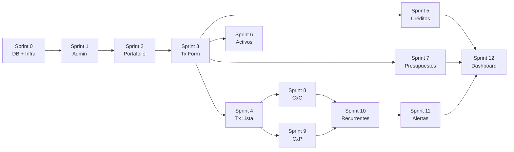

# FASE 3 — PLAN DE IMPLEMENTACIÓN

## Convenciones del Plan

- **C** = Crear archivo nuevo
- **M** = Modificar archivo existente
- Complejidad: 🟢 Baja | 🟡 Media | 🔴 Alta

---

## Sprint 0 — Base de Datos + Infraestructura Compartida
**Complejidad: 🟡 Media** | ~2h

### Objetivo
Ejecutar la migración SQL y crear componentes compartidos reutilizables.

### Pasos

| Acción | Archivo | Descripción |
|--------|---------|-------------|
| **C** | `supabase/migrations/20260430000001_v2_schema_upgrade.sql` | Migración aprobada en Fase 2 |
| **M** | `types/database.types.ts` | Regenerar con `supabase gen types` tras migración |
| **C** | `lib/utils/file-upload.ts` | Utilidad para subir/descargar archivos del bucket `attachments` |
| **C** | `lib/utils/currency-format.ts` | Formato `#,000.00` + equivalencia USD/PEN reutilizable |
| **C** | `components/ui/ViewToggle.tsx` | Toggle lista/tarjetas reutilizable (usado en 7 módulos) |
| **C** | `components/ui/CardView.tsx` | Componente genérico de vista tarjetas |
| **C** | `components/ui/ProgressBar.tsx` | Barra de progreso con % (usada en Créditos, CxC, CxP, Presupuestos) |
| **C** | `components/ui/FileUpload.tsx` | Componente UI de subida de archivos (drag & drop) |
| **C** | `components/ui/CountrySelect.tsx` | Selector de países del mundo |
| **C** | `components/ui/CurrencyDisplay.tsx` | Muestra monto con equivalencia en otra moneda debajo |

### Funciones Supabase
- Ejecutar SQL de migración en SQL Editor
- Verificar bucket `attachments` creado correctamente
- `supabase gen types typescript --project-id <ID> > types/database.types.ts`

---

## Sprint 1 — Administración
**Complejidad: 🟡 Media** | ~3h

### Objetivo
Agregar gestión de Monedas y Tipos de Activo. Mejorar Entidades Bancarias y Categorías.

### Pasos

| Acción | Archivo | Descripción |
|--------|---------|-------------|
| **C** | `components/management/CurrenciesManager.tsx` | CRUD de monedas del usuario (`user_currencies`) |
| **C** | `components/management/AssetTypesManager.tsx` | CRUD de tipos de activo (`asset_types`) |
| **M** | `components/management/AdminWorkspace.tsx` | Agregar pestañas Monedas y Tipos de Activo |
| **M** | `components/management/BankEntitiesManager.tsx` | Campo País como `CountrySelect`, upload de icono |
| **M** | `components/management/CategoriesManager.tsx` | Verificar scope Ingreso/Egreso, upload de icono |
| **C** | `modules/admin/currency.repository.ts` | Repository para `user_currencies` |
| **C** | `modules/admin/asset-type.repository.ts` | Repository para `asset_types` |
| **M** | `app/actions/admin.actions.ts` | Server actions para Monedas y Tipos de Activo (crear si no existe) |

### Funciones Supabase
- CRUD directo via cliente Supabase (select, insert, update, delete)
- RLS ya configurada en migración

---

## Sprint 2 — Portafolio
**Complejidad: 🟡 Media** | ~2h

### Objetivo
Vista tarjetas, filtros mejorados, validación de eliminación.

### Pasos

| Acción | Archivo | Descripción |
|--------|---------|-------------|
| **M** | `components/management/PortfolioManager.tsx` | Vista tarjetas (toggle), filtros en una fila (buscar, entidad, tipo, moneda, estado), resumen numérico superior |
| **M** | `components/management/PortfolioManager.tsx` | Moneda desde `user_currencies`, entidad bancaria validada |
| **C** | `modules/portfolio/portfolio.repository.ts` | Repository con validación de eliminación (verificar transacciones) |
| **M** | `app/(dashboard)/portfolio/page.tsx` | Pasar datos de entidades bancarias y monedas al manager |

### Funciones Supabase
- `select('*, bank_entities(*)')` para join con entidad bancaria
- Validación: `select count(*) from transactions where source_account_id = $id`

---

## Sprint 3 — Transacciones (Parte 1: Formulario Ampliado)
**Complejidad: 🔴 Alta** | ~5h

### Objetivo
Ampliar formulario con nuevos tipos de operación, forma de pago, adjuntos, guardar como recurrente.

### Pasos

| Acción | Archivo | Descripción |
|--------|---------|-------------|
| **M** | `components/forms/TransactionForm/TypeSelector.tsx` | Agregar tipos: Compra de Activo, Cuentas por Pagar, Cuentas por Cobrar |
| **M** | `components/forms/TransactionForm/FormFields.tsx` | Campos: forma de pago, presupuesto, remitente, destinatario, adjunto, deudor, acreedor |
| **M** | `components/forms/TransactionForm/index.tsx` | Lógica condicional para cada tipo de operación |
| **M** | `components/forms/TransactionForm/form.orchestrator.ts` | Orquestador actualizado con nuevos campos |
| **C** | `components/forms/TransactionForm/sections/AssetPurchaseFields.tsx` | Campos específicos de Compra de Activo |
| **C** | `components/forms/TransactionForm/sections/ReceivableFields.tsx` | Campos específicos de Cuentas por Cobrar |
| **C** | `components/forms/TransactionForm/sections/PayableFields.tsx` | Campos específicos de Cuentas por Pagar |
| **C** | `components/forms/TransactionForm/SaveAsRecurring.tsx` | Botón + modal para guardar como recurrente |
| **M** | `lib/schemas/transaction.schemas.ts` | Validaciones Zod para nuevos campos |
| **M** | `modules/transactions/transaction.validations.ts` | Validaciones servidor para sub_type, payment_method |
| **M** | `modules/transactions/transaction.service.ts` | Lógica de negocio para nuevos tipos + attachment upload |
| **M** | `modules/transactions/transaction.service.types.ts` | Tipos actualizados |
| **M** | `modules/transactions/transaction.repository.ts` | Queries con nuevas columnas |
| **M** | `app/actions/transaction.actions.ts` | Server actions actualizados |
| **M** | `lib/server/transaction-form-options.ts` | Cargar opciones: presupuestos, deudores, acreedores |

### Funciones Supabase
- `storage.from('attachments').upload()` para adjuntos
- Queries con joins a `budgets`, `debtors`, `creditors`
- Insert en `recurring_transactions` al guardar como recurrente

---

## Sprint 4 — Transacciones (Parte 2: Lista y Filtros)
**Complejidad: 🟡 Media** | ~2h

### Objetivo
Mejorar tabla de transacciones con nuevos filtros y datos visuales.

### Pasos

| Acción | Archivo | Descripción |
|--------|---------|-------------|
| **M** | `components/tables/TransactionTable.tsx` | Iconos de color por tipo (🔴🟢🔵), mostrar sub_type, adjunto |
| **M** | `components/tables/TransactionTable.tsx` | Filtros: buscar descripción, tipo operación, portafolio, categoría (dependiente), fecha desde/hasta |
| **M** | `app/(dashboard)/transactions/page.tsx` | Pasar opciones de filtro desde servidor |

### Funciones Supabase
- Queries filtradas con `.ilike()`, `.eq()`, `.gte()`, `.lte()`

---

## Sprint 5 — Créditos
**Complejidad: 🔴 Alta** | ~5h

### Objetivo
Separar Tarjeta de Crédito vs Crédito Bancario, implementar Ciclos de Facturación, cronograma mejorado.

### Pasos

| Acción | Archivo | Descripción |
|--------|---------|-------------|
| **M** | `components/management/CreditsManager.tsx` | Refactor: separar secciones TC vs Bancario, vista tarjetas, barra progreso |
| **C** | `components/management/BillingCyclesEditor.tsx` | Tabla editable de ciclos de facturación (mes, año, consumos, pago, upload estado cuenta) |
| **C** | `components/management/LoanScheduleEditor.tsx` | Cronograma de pagos mejorado (+ seguro, otros, upload constancia) |
| **C** | `components/management/CreditAlertsSidebar.tsx` | Panel lateral de vencimientos próximos (tarjetas + bancarios) |
| **M** | `modules/credits/credit.repository.ts` | Queries para billing_cycles, join con bank_entities |
| **C** | `modules/credits/billing-cycle.repository.ts` | CRUD de ciclos de facturación |
| **M** | `modules/loans/loan.repository.ts` | Campos: name, disbursement_account_id, bank_entity_id, seguro, otros |
| **M** | `components/tables/CreditsAssetsTable.tsx` | Actualizar tabla con barra de progreso, nuevos campos |
| **M** | `app/(dashboard)/credits/page.tsx` | Pasar datos de entidades bancarias, portafolios TC |
| **M** | `app/(dashboard)/credits/[id]/page.tsx` | Detalle con ciclos/cronograma |

### Funciones Supabase
- CRUD `billing_cycles` con validación unicidad mes+año
- `storage.from('attachments').upload()` para estados de cuenta y constancias
- Queries con joins: `credits → accounts → bank_entities`, `loans → installments`

---

## Sprint 6 — Activos
**Complejidad: 🟡 Media** | ~2h

### Objetivo
Tipo de activo flexible desde Administración, adjuntos, vista tarjetas.

### Pasos

| Acción | Archivo | Descripción |
|--------|---------|-------------|
| **M** | `components/tables/CreditsAssetsTable.tsx` | Sección Activos: tipo desde `asset_types`, adjunto, destinatario, vista tarjetas |
| **M** | `modules/assets/asset.repository.ts` | Queries con `asset_type_id` join, attachment_url |
| **M** | `components/detail/ModuleDetails.tsx` | Detalle de activo con nuevos campos |
| **M** | `app/(dashboard)/assets/page.tsx` | Pasar tipos de activo desde servidor |
| **M** | `app/(dashboard)/assets/[id]/page.tsx` | Detalle con adjunto y tipo flexible |

### Funciones Supabase
- `select('*, asset_types(*)')` para join con tipo de activo
- Validación: eliminar activo elimina su transacción (cascade o lógica)

---

## Sprint 7 — Presupuestos
**Complejidad: 🟡 Media** | ~2.5h

### Objetivo
Fecha fin automática, períodos consecutivos, detalle de transacciones por período.

### Pasos

| Acción | Archivo | Descripción |
|--------|---------|-------------|
| **M** | `components/management/BudgetsManager.tsx` | Nombre único, fecha fin automática según periodicidad, descripción |
| **C** | `components/management/BudgetPeriodsManager.tsx` | Gestión de períodos consecutivos con botón crear nuevo período |
| **C** | `components/management/BudgetTransactionsView.tsx` | Vista de transacciones dentro del período (fecha, portafolio, destinatario, descripción, importe) |
| **M** | `app/(dashboard)/budgets/page.tsx` | Pasar categorías y datos de períodos |

### Funciones Supabase
- Query: transacciones donde `budget_id = $id` AND `transaction_date BETWEEN start_date AND end_date`
- Validación: nombre duplicado con `idx_budgets_user_name`
- Cálculo automático de `end_date` basado en `period_type` y `start_date`

---

## Sprint 8 — Cuentas por Cobrar
**Complejidad: 🟡 Media** | ~3h

### Objetivo
Gestión de deudores como entidades, barra de progreso, vista tarjetas.

### Pasos

| Acción | Archivo | Descripción |
|--------|---------|-------------|
| **C** | `components/management/DebtorsManager.tsx` | CRUD de deudores (nombre, deuda inicial, relación) |
| **M** | `components/tables/ReceivablesPayablesTable.tsx` | Sección CxC: deudores con barra de progreso %, vista tarjetas |
| **C** | `components/detail/DebtorTransactionsModal.tsx` | Modal con transacciones del deudor + filtros |
| **M** | `modules/receivables/receivable.repository.ts` | Queries con `debtor_id` join, attachment_url |
| **C** | `modules/receivables/debtor.repository.ts` | CRUD deudores |
| **M** | `app/(dashboard)/receivables/page.tsx` | Pasar deudores, resumen cobradas vs pendientes |
| **M** | `app/(dashboard)/receivables/[id]/page.tsx` | Detalle con transacciones del deudor |

### Funciones Supabase
- CRUD `debtors` con validación unicidad nombre
- Aggregate: `SUM(collected_amount)` vs `SUM(amount)` por deudor para barra progreso
- Filtros: estado, ordenar por mayor/menor deuda

---

## Sprint 9 — Cuentas por Pagar
**Complejidad: 🟡 Media** | ~3h

### Objetivo
Gestión de acreedores como entidades, barra de progreso, vista tarjetas.

### Pasos

| Acción | Archivo | Descripción |
|--------|---------|-------------|
| **C** | `components/management/CreditorsManager.tsx` | CRUD de acreedores (nombre, deuda inicial, relación) |
| **M** | `components/tables/ReceivablesPayablesTable.tsx` | Sección CxP: acreedores con barra de progreso %, vista tarjetas |
| **C** | `components/detail/CreditorTransactionsModal.tsx` | Modal con transacciones del acreedor + filtros |
| **M** | `modules/payables/payable.repository.ts` | Queries con `creditor_id` join, attachment_url |
| **C** | `modules/payables/creditor.repository.ts` | CRUD acreedores |
| **M** | `app/(dashboard)/payables/page.tsx` | Pasar acreedores, resumen pagadas vs pendientes |
| **M** | `app/(dashboard)/payables/[id]/page.tsx` | Detalle con transacciones del acreedor |

### Funciones Supabase
- CRUD `creditors` con validación unicidad nombre
- Aggregate: `SUM(paid_amount)` vs `SUM(amount)` por acreedor para barra progreso

---

## Sprint 10 — Transacciones Recurrentes (NUEVO)
**Complejidad: 🟡 Media** | ~3h

### Objetivo
Módulo completo desde cero.

### Pasos

| Acción | Archivo | Descripción |
|--------|---------|-------------|
| **C** | `app/(dashboard)/recurring/page.tsx` | Página del módulo |
| **C** | `components/management/RecurringTransactionsManager.tsx` | UI completa: resumen, filtros, lista con acciones |
| **C** | `modules/recurring/recurring.repository.ts` | CRUD recurring_transactions |
| **C** | `modules/recurring/recurring.service.ts` | Lógica: "Usar" pre-llena formulario, validaciones |
| **C** | `app/actions/recurring.actions.ts` | Server actions |
| **M** | `app/(dashboard)/layout.tsx` | Agregar entrada "Recurrentes" al sidebar |
| **M** | `components/layout/AppShell.tsx` | Agregar nav item para Recurrentes |

### Funciones Supabase
- CRUD `recurring_transactions`
- Query con joins a `accounts`, `categories`

---

## Sprint 11 — Alertas
**Complejidad: 🔴 Alta** | ~4h

### Objetivo
Reestructurar con tipos (Crítica, Operativa, Sugerencia), generación automática.

### Pasos

| Acción | Archivo | Descripción |
|--------|---------|-------------|
| **M** | `components/alerts/AlertsCenter.tsx` | Refactor: resumen por tipo, filtros (tipo, estado, módulo), acción directa |
| **C** | `modules/alerts/alert-generator.ts` | Lógica de generación de alertas por tipo |
| **C** | `modules/alerts/alert.repository.ts` | Queries para app_notifications con alert_type, source_module |
| **C** | `supabase/migrations/20260430000002_alert_cron_functions.sql` | Funciones pg_cron para alertas automáticas |
| **M** | `lib/server/app-notifications.ts` | Actualizar para usar alert_type y source_module |
| **M** | `app/(dashboard)/alerts/page.tsx` | Pasar datos con filtros |

### Funciones Supabase — pg_cron

```sql
-- Ejecutar diariamente a las 06:00 AM
-- 1. Cuotas de crédito bancario venciendo en 7 días → CRITICAL
-- 2. Fecha pago tarjeta de crédito en 7 días → CRITICAL
-- 3. Cuentas por pagar vencidas → CRITICAL
-- 4. Presupuesto ≥ 80% → OPERATIONAL
-- 5. Presupuesto excedido → OPERATIONAL
-- 6. Cuenta por cobrar > 30 días → OPERATIONAL
-- 7. Recurrente no usada en período → SUGGESTION
```

---

## Sprint 12 — Dashboard (Mejoras Finales)
**Complejidad: 🟡 Media** | ~3h

### Objetivo
Agregar widgets nuevos y mejoras propuestas en el PRD.

### Pasos

| Acción | Archivo | Descripción |
|--------|---------|-------------|
| **C** | `components/dashboard/widgets/BudgetsWidget.tsx` | Presupuestos del Mes: estado, barra progreso, % ejecución |
| **C** | `components/dashboard/widgets/CreditsUsageWidget.tsx` | Créditos Uso Rápido: línea vs consumo TC, capital vs pendiente bancario |
| **M** | `components/dashboard/widgets/FinanceWidgets.tsx` | Variación mensual en Saldos Bancarios (+/- vs mes anterior) |
| **M** | `components/dashboard/widgets/ReceivablesPayablesWidget.tsx` | Mini-listado top 3 deudores/acreedores con enlace |
| **M** | `components/dashboard/widgets/ExpenseBreakdown.tsx` | Toggle Egresos/Ingresos por Categoría |
| **M** | `components/dashboard/DashboardClient.tsx` | Integrar nuevos widgets, ajustar mini-tarjetas módulos |
| **M** | `modules/dashboard/dashboard.service.ts` | Queries para presupuestos del mes, uso de créditos, variación mensual |
| **M** | `modules/dashboard/dashboard.types.ts` | Tipos para nuevos widgets |
| **M** | `app/(dashboard)/dashboard/page.tsx` | Pasar datos de nuevos widgets |

### Funciones Supabase
- Query presupuestos activos del mes con ejecución calculada
- Query créditos: línea vs consumo (TC), capital vs pendiente (bancarios)
- Query variación: saldo consolidado mes actual vs mes anterior

---

## Resumen General

| Sprint | Módulo | Archivos Nuevos | Archivos Modificados | Complejidad | Estimado |
|--------|--------|:-:|:-:|:-:|:-:|
| 0 | DB + Infraestructura | 8 | 1 | 🟡 | 2h |
| 1 | Administración | 4 | 3 | 🟡 | 3h |
| 2 | Portafolio | 1 | 2 | 🟡 | 2h |
| 3 | Transacciones (Form) | 4 | 10 | 🔴 | 5h |
| 4 | Transacciones (Lista) | 0 | 3 | 🟡 | 2h |
| 5 | Créditos | 4 | 5 | 🔴 | 5h |
| 6 | Activos | 0 | 5 | 🟡 | 2h |
| 7 | Presupuestos | 2 | 2 | 🟡 | 2.5h |
| 8 | Cuentas por Cobrar | 3 | 3 | 🟡 | 3h |
| 9 | Cuentas por Pagar | 3 | 3 | 🟡 | 3h |
| 10 | Trans. Recurrentes | 5 | 2 | 🟡 | 3h |
| 11 | Alertas | 3 | 3 | 🔴 | 4h |
| 12 | Dashboard | 2 | 7 | 🟡 | 3h |
| **TOTAL** | | **39** | **49** | | **~39.5h** |

---

## Orden de Ejecución Recomendado



> [!IMPORTANT]
> **Esperando tu aprobación para comenzar la Fase 4 (Implementación).**
> Al aprobar, comenzaré con el Sprint 0 (DB + Infraestructura) y te consultaré los archivos específicos antes de tocar cada módulo.
