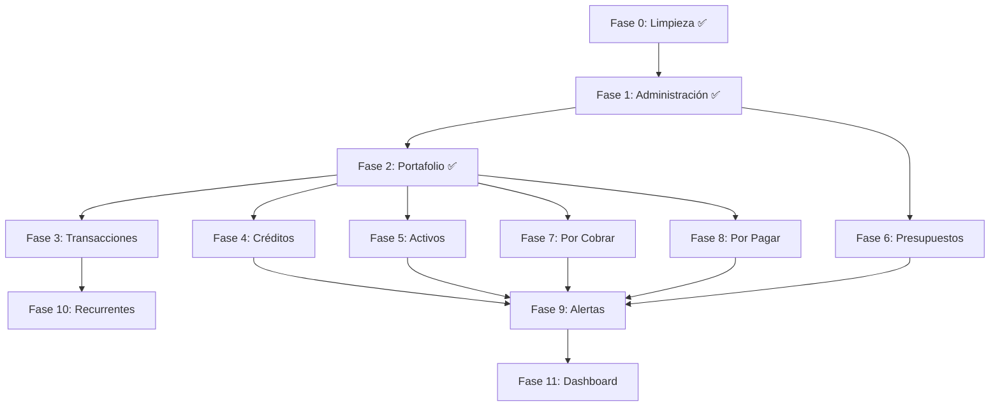

# Plan de Implementación: FinTrack PRD v3 — Concordancia Estricta

> [!IMPORTANT]
> Este plan refleja **exactamente** lo que dice `fintrack-prd-v3.md`. Cada campo, filtro y acción listados aquí provienen textualmente del PRD. No se agregan campos ni funcionalidades que no estén documentados.

---

## Progreso General

| Fase | Módulo PRD | Estado |
|------|-----------|--------|
| 0 | Limpieza y Preparación | ✅ Completada |
| 1 | Administración (Módulo 10) | ✅ Completada |
| 2 | Portafolio (Módulo 2) | ✅ Completada |
| 3 | Transacciones (Módulo 3) | ✅ Completada |
| 4 | Créditos (Módulo 4) | ✅ Completada |
| 5 | Activos (Módulo 5) | ✅ Completada |
| 6 | Presupuestos (Módulo 6) | ✅ Completada |
| 7 | Cuentas por Cobrar (Módulo 7) | ✅ Completada |
| 8 | Cuentas por Pagar (Módulo 8) | ✅ Completada |
| 9 | Alertas (Módulo 9) | ✅ Completada |
| 10.1 | Trans. Recurrentes — Backend | ✅ Completada |
| 10.2 | Trans. Recurrentes — UI | ✅ Completada |
| 11.1 | Dashboard — Backend & Queries | ✅ Completada |
| 11.2 | Dashboard — Panel Central (Gráficos + KPIs) | ✅ Completada |
| 11.3 | Dashboard — Panel Derecho (Widgets laterales) | ✅ Completada |
| 11.4 | Dashboard — Integración & Página Final | ✅ Completada |

---

## Fases Completadas

### ✅ Fase 0: Limpieza y Preparación
- [x] Eliminar `app/design-review/` y `components/mockups/`
- [x] Mantener `settings/` (confirmado por usuario)
- [x] Agregar ruta `recurring` en nav + placeholder page
- [x] Limpiar middleware

### ✅ Fase 1: Administración (Módulo 10) — PRD líneas 555-588

**Entidad Bancaria** — campos PRD:
- [x] Nombre de Entidad Bancaria (obligatorio)
- [x] Nombre Corto
- [x] País (lista desplegable, obligatorio)
- [x] Color (catálogo, default si no selecciona)
- [x] Icono (catálogo, permite subir imagen, default si no selecciona)

**Moneda** — campos PRD:
- [x] País (lista desplegable, obligatorio)
- [x] Moneda (catálogo, obligatorio)

**Categoría** — campos PRD:
- [x] Nombre de Categoría (obligatorio)
- [x] Tipo de Categoría: Ingreso / Egreso (obligatorio)
- [x] Color (catálogo, default si no selecciona)
- [x] Icono (catálogo, permite subir imagen, default si no selecciona)

**Tipo de Activo** — campos PRD:
- [x] Nombre de tipo de activo (obligatorio)
- [x] Defaults del sistema: Tecnología, Vehículo, Inmueble, Otro

**Acciones por registro** (las 4 entidades):
- [x] Editar
- [x] Eliminar (no si tiene registros relacionados)
- [x] Desactivar (si activo)
- [x] Activar (si desactivado)

### ✅ Fase 2: Portafolio (Módulo 2) — PRD líneas 109-152

**Resumen superior** — PRD:
- [x] Resumen de cuentas activas e inactivas (solo datos numéricos)
- [x] Botón crear nuevo portafolio

**Campos del modal crear** — PRD (exactos, sin agregar):
- [x] Nombre de portafolio (obligatorio)
- [x] Entidad Bancaria (desplegable desde Administración, obligatorio)
- [x] Tipo de Portafolio: Cuenta corriente, Cuenta de ahorros, Cuenta de efectivo, Tarjeta de crédito, Acciones, ETF, Cripto-activos (obligatorio)
- [x] Moneda (desplegable desde Administración, obligatorio)
- [x] Saldo Inicial (numérico, formato #,000.00)
- [x] Color (catálogo, default si no selecciona)
- [x] Icono (catálogo, default si no selecciona)
- [x] Notas (opcional)
- [x] Estado: default "Activo" (implícito)

**Filtros** — PRD:
- [x] Buscar portafolio (texto libre)
- [x] Entidad Bancaria (desplegable)
- [x] Tipo de Portafolio (desplegable)
- [x] Moneda (desplegable)
- [x] Estado (desplegable)
- [x] Iconos vista lista / vista tarjetas

**Lista/Tarjetas** — PRD:
- [x] Nombre, icono, entidad bancaria, tipo, moneda, saldo, estado
- [x] Estado coloreado: 🔴 Desactivado, 🟢 Activo

**Acciones** — PRD:
- [x] Editar
- [x] Eliminar (no si tiene transacciones)
- [x] Desactivar (si activo)
- [x] Activar (si desactivado)

---

## Fases Pendientes

### ✅ Fase 3: Transacciones (Módulo 3) — PRD líneas 155-272

> [!WARNING]
> Este es el módulo más complejo. Tiene 6 tipos de operación, cada uno con campos distintos.

**Resumen superior** — PRD:
- [x] Resumen de transacciones: egresos, ingresos, transferencias
- [x] Botón crear nueva transacción → modal pregunta tipo de operación
- [x] Botón exportar movimientos
- [x] Removido ScreenHero/CreateModuleButton (patrón v3)

**Tipo 1: Ingreso** — campos PRD:
- [x] Portafolio (desplegable desde Portafolio, obligatorio)
- [x] Fecha (calendario, obligatorio)
- [x] Categoría (desplegable desde Administración, obligatorio)
- [x] Descripción (texto libre)
- [x] Moneda (automático según portafolio, no editable)
- [x] Monto (numérico #,000.00, obligatorio + equivalencia USD/PEN debajo)
- [ ] Remitente (texto libre) — ⏳ requiere columna DB, pendiente
- [x] Notas (texto libre)
- [x] Adjuntar constancia o comprobante (foto, PDF, Word, Excel)
- [x] Botón "guardar como transacción recurrente"

**Tipo 2: Egreso** — campos PRD:
- [x] Forma de pago: Débito / Crédito (obligatorio)
- [x] Portafolio (desplegable filtrado por forma de pago, obligatorio)
- [x] Fecha (calendario, obligatorio)
- [x] Categoría (desplegable desde Administración, obligatorio)
- [ ] Presupuesto (desplegable filtrado) — ⏳ depende de Fase 6
- [x] Descripción (texto libre)
- [x] Moneda (automático, no editable)
- [x] Monto (numérico, obligatorio + equivalencia)
- [ ] Destinatario (texto libre) — ⏳ requiere columna DB, pendiente
- [x] Notas (texto libre)
- [x] Adjuntar constancia o comprobante
- [x] Botón "guardar como transacción recurrente"

**Tipo 3: Transferencia** — campos PRD:
- [x] Portafolio (Desde) (desplegable, obligatorio)
- [x] Portafolio (Hacia) (desplegable, obligatorio)
- [x] Fecha (calendario, obligatorio)
- [x] Descripción (texto libre)
- [x] Monto (numérico, obligatorio + equivalencia)
- [x] Notas (texto libre)
- [x] Adjuntar constancia o comprobante
- [x] Botón "guardar como transacción recurrente"

**Tipo 4: Compra de Activo** — campos PRD:
- [x] Activado via módulo "Activo" en formulario egreso
- [x] Portafolio, Fecha, Tipo de Activo, Descripción, Moneda, Monto
- [x] Notas, Adjuntar

**Tipo 5: Cuentas por pagar** — campos PRD:
- [x] Activado via módulo "Por pagar" en formulario
- [x] Portafolio, Fecha, Descripción, Moneda, Monto, Notas, Adjuntar
- [x] Botón "guardar como transacción recurrente"

**Tipo 6: Cuentas por cobrar** — campos PRD:
- [x] Activado via módulo "Por cobrar" en formulario
- [x] Portafolio, Fecha, Descripción, Moneda, Monto, Notas, Adjuntar
- [x] Botón "guardar como transacción recurrente"

**Filtros** — PRD:
- [x] Buscar descripción (texto)
- [x] Tipo de operación (quick filter pills)
- [x] Portafolio (desplegable)
- [x] Categoría (desplegable)
- [x] Fecha Desde (calendario) — agregado
- [x] Fecha Hasta (calendario) — agregado

**Lista** — PRD:
- [x] Icono con color por tipo: 🔴 Egreso, 🟢 Ingreso, 🔵 Transferencia
- [x] Acciones: Editar, Eliminar (con modal confirmación)

> [!NOTE]
> Campos pendientes (Remitente, Destinatario) requieren migración de esquema DB.
> Campo Presupuesto en Egreso depende de que Fase 6 (Presupuestos) esté completada.

---

### ✅ Fase 4: Créditos (Módulo 4) — PRD líneas 275-355

**Resumen superior**: créditos activos y cancelados + botón crear

**Tipo 1: Tarjeta de Crédito** — campos PRD exactos:
- [x] Nombre de Crédito (obligatorio)
- [x] Portafolio (solo tipo "Tarjeta de crédito", obligatorio)
- [x] Entidad Bancaria (automático desde portafolio)
- [x] Línea de Crédito (numérico, obligatorio, > 0)
- [x] Consumo Actual (numérico)
- [x] Estado: default "Activo"
- [x] Ciclos de Facturación (botón "Ciclos" → tabla lateral):
  - Mes de Facturación (desplegable ene-dic)
  - Año de Facturación (desplegable 2016-2027)
  - Consumos desde (calendario, obligatorio)
  - Consumos hasta (calendario, obligatorio)
  - Fecha de Pago (calendario, obligatorio)
  - Total a Pagar (calculado: pagos - consumos del mes)
  - Estado de Cuenta (subir archivo)
  - Restricción: no duplicar Mes+Año
  - 1 fila por defecto + botón agregar

**Tipo 2: Crédito Bancario** — campos PRD exactos:
- [x] Nombre de Crédito (obligatorio)
- [x] Entidad Bancaria (desplegable desde Administración, obligatorio)
- [x] Cuenta destino de desembolso (solo Cuenta corriente, ahorros o efectivo, obligatorio)
- [x] Moneda (automático, no editable)
- [x] Fecha de Desembolso (calendario, obligatorio)
- [x] Inicio de Cuotas (calendario, obligatorio)
- [x] Número de Cuotas (entero, obligatorio)
- [x] Capital prestado (numérico, obligatorio)
- [x] Descripción (texto libre)
- [x] Estado: default "Activo"
- [x] Cronograma de pagos (botón "Cronograma" → tabla lateral):
  - Fecha de Vencimiento (primera = Inicio Cuotas, siguientes +30 días)
  - Capital (numérico)
  - Intereses (numérico)
  - Seguro (numérico)
  - Otros (numérico)
  - Cuota (suma automática)
  - Constancia de Pago (subir archivo)
  - Fila de totales al final

**Filtros** — PRD:
- [x] Buscar descripción (texto)
- [x] Tipo de crédito (Tarjeta / Préstamo Bancario)
- [x] Estado (desplegable)
- [x] Entidad Bancaria (desplegable)
- [x] Vista lista / tarjetas

**Lista** — PRD:
- [x] Estado coloreado: 🔴 Desactivado, 🟢 Activo
- [x] Barra de progreso con porcentaje por crédito
- [x] Acciones: Editar, Eliminar (no si tiene transacciones), Desactivar, Activar
- [x] Panel lateral derecho: alertas de vencimientos (tarjetas y bancarios separados)

---

### ✅ Fase 5: Activos (Módulo 5) — PRD líneas 358-393

**Resumen superior**: activos activos y dados de baja + botón crear (= Egreso)

**Campos crear** — PRD exactos:
- [x] Portafolio (desplegable, obligatorio)
- [x] Fecha (calendario, obligatorio)
- [x] Tipo de Activo (desplegable desde Administración, obligatorio)
- [x] Descripción (texto libre)
- [x] Moneda (automático, no editable)
- [x] Monto (numérico, obligatorio + equivalencia)
- [x] Destinatario (texto libre)
- [x] Notas (texto libre)
- [x] Adjuntar constancia o comprobante

**Filtros** — PRD:
- [x] Buscar descripción (texto)
- [x] Tipo de activo (desplegable)
- [x] Fecha Desde (calendario)
- [x] Fecha Hasta (calendario)
- [x] Vista lista / tarjetas (por tipo de activo)

**Acciones** — PRD:
- [x] Editar
- [x] Eliminar (elimina el activo Y su transacción egreso)
- [x] Desactivar (si activo)
- [x] Activar (si desactivado)

---

### ✅ Fase 6: Presupuestos (Módulo 6) — PRD líneas 396-433

**Resumen superior**: presupuestos activos y desactivados + botón crear

**Campos crear** — PRD exactos:
- [x] Nombre (obligatorio, prohibido duplicar)
- [x] Categoría (desplegable desde Administración, obligatorio)
- [x] Periodicidad: Semanal, Mensual, Trimestral, Anual (obligatorio)
- [x] Monto (numérico, obligatorio)
- [x] Moneda (desplegable desde Administración, obligatorio)
- [x] Fecha de inicio (calendario, obligatorio)
- [x] Fecha de fin (automática según periodicidad)
- [ ] Descripción (texto libre) — ⏳ campo no incluido en el formulario actual
- [x] Notas (texto libre)

**Lógica de períodos** — PRD:
- [x] Fecha de fin calculada automáticamente según periodicidad
- [ ] Crear nuevos períodos con continuidad automática — ⏳ pendiente
- [ ] Botón por período → ver transacciones — ⏳ pendiente

**Filtros** — PRD:
- [x] Buscar descripción (texto)
- [x] Moneda (desplegable)
- [x] Categoría (desplegable)
- [x] Estado (desplegable)
- [x] Vista lista / tarjetas

**Acciones** — PRD:
- [x] Editar
- [x] Eliminar (no si tiene transacciones)
- [x] Desactivar / Activar

---

### ✅ Fase 7: Cuentas por Cobrar (Módulo 7) — PRD líneas 436-475

**Resumen superior**: cobradas y pendientes

**Crear cuenta por cobrar** (= Egreso) — campos PRD exactos:
- [x] Portafolio (desplegable, obligatorio)
- [x] Fecha (calendario, obligatorio)
- [x] Deudor (desplegable desde módulo, obligatorio)
- [x] Descripción (texto libre)
- [x] Moneda (automático, no editable)
- [x] Monto (numérico, obligatorio + equivalencia)
- [x] Notas (texto libre)
- [x] Adjuntar constancia o comprobante
- [x] Botón "guardar como transacción recurrente"

**Crear deudor** — campos PRD exactos:
- [x] Deudor (nombre, obligatorio)
- [x] Deuda inicial (numérico)
- [x] Relación (texto libre)

**Filtros** — PRD:
- [x] Estado: Cobrados, Pendientes, Todos
- [x] Ordenar: mayores a menores / menores a mayores
- [x] Vista lista / tarjetas

**Detalle deudor** — PRD:
- [x] Click en deudor → ventana con transacciones (fecha, portafolio, descripción, importe)
- [x] Total al final
- [x] Filtros internos: Buscar descripción, Portafolio, Fecha Desde, Fecha Hasta
- [x] Barra de progreso con porcentaje de cobro

---

### ✅ Fase 8: Cuentas por Pagar (Módulo 8) — PRD líneas 478-516

> [!NOTE]
> Fase dividida en 4 subfases. Implementar en orden, una a la vez con aprobación del usuario.

---

#### ✅ Fase 8.1 — Base de Datos y API (Backend)

> Establecer la capa de datos y server actions para acreedores y cuentas por pagar, espejando el patrón de Fase 7.

**Tabla `creditors`** (acreedores):
- [x] Tabla ya existente en migración `20260430000001_v2_schema_upgrade.sql`
- [x] RLS y triggers `updated_at` ya configurados

**Tabla `accounts_payable`** (cuentas por pagar):
- [x] Tabla ya existente en migración `20240101000001_initial_schema.sql`
- [x] Columna `creditor_id` + `attachment_url` añadidas en `20260430000001_v2_schema_upgrade.sql`

**API Routes** (patrón REST, espejo de Módulo 7):
- [x] `GET /api/creditors` — lista acreedores con datos agregados (total_owed, total_paid, progress_pct)
- [x] `POST /api/creditors` — crear acreedor con validación de nombre único
- [x] `GET /api/creditors/[id]` — obtener acreedor por id
- [x] `PATCH /api/creditors/[id]` — editar / activar / desactivar acreedor
- [x] `DELETE /api/creditors/[id]` — eliminar (guard: no si tiene cuentas)
- [x] `GET /api/payables` — lista cuentas por pagar con join a creditor, filtros status/creditor_id/sort
- [x] `POST /api/payables` — crear cuenta por pagar
- [x] `GET /api/payables/[id]` — obtener cuenta individual
- [x] `PATCH /api/payables/[id]` — editar / marcar como pagada
- [x] `DELETE /api/payables/[id]` — eliminar

---

#### ✅ Fase 8.2 — Formulario de Acreedor (`CreditorForm`)

> Componente modal reutilizable para crear/editar acreedores, espejando `DebtorForm` de Fase 7.

**Componente** (`components/payables/CreditorForm.tsx`):
- [x] Campos PRD exactos:
  - [x] Acreedor (nombre, obligatorio)
  - [x] Deuda inicial (numérico, formato #,000.00)
  - [x] Relación (texto libre)
- [x] Modo crear / editar (prop `creditor?`)
- [x] Validación y toast de éxito/error
- [x] Integración con `/api/creditors` (Fase 8.1)

---

#### ✅ Fase 8.3 — Formulario de Cuenta por Pagar (`PayableForm`)

> Componente modal para registrar una nueva cuenta por pagar (= Egreso), espejando `ReceivableForm` de Fase 7.

**Componente** (`components/payables/PayableForm.tsx`):
- [x] Campos PRD exactos:
  - [x] Portafolio (desplegable, obligatorio)
  - [x] Fecha (calendario, obligatorio)
  - [x] Acreedor (desplegable desde módulo, obligatorio)
  - [x] Descripción (texto libre)
  - [x] Moneda (automático desde portafolio, no editable)
  - [x] Monto (numérico, obligatorio + equivalencia USD/PEN debajo)
  - [x] Notas (texto libre)
  - [x] Adjuntar constancia o comprobante (foto, PDF, Word, Excel)
  - [x] Botón "guardar como transacción recurrente"
- [x] Modo crear / editar
- [x] Validación y toast de éxito/error
- [x] Integración con `/api/payables` (Fase 8.1)

---

#### ✅ Fase 8.4 — Manager UI (`PayablesWorkspace`)

> Vista principal del módulo con resumen, filtros, lista/tarjetas de acreedores, y detalle de acreedor con barra de progreso.

**Componentes creados**:
- [x] `components/payables/PayablesWorkspace.tsx` — manager principal
- [x] `components/payables/CreditorDetail.tsx` — vista detalle de acreedor

**Resumen superior** — PRD:
- [x] Contador de cuentas pagadas
- [x] Contador de cuentas pendientes
- [x] Total por pagar acumulado

**Filtros** — PRD:
- [x] Estado: Cancelados, Pendientes, Todos
- [x] Ordenar: mayores a menores / menores a mayores
- [x] Toggle vista lista / tarjetas
- [x] Búsqueda por nombre/relación

**Lista/Tarjetas de acreedores** — PRD:
- [x] Nombre del acreedor, relación, deuda total, monto pagado, monto pendiente
- [x] Barra de progreso con porcentaje de pago
- [x] Estado coloreado: 🔴 Pendiente, 🟢 Cancelado
- [x] Acciones por acreedor: Editar, Eliminar (guard: no si tiene cuentas), Desactivar, Activar

**Detalle acreedor** — PRD:
- [x] Click en acreedor → vista con cuentas por pagar (fecha, portafolio, descripción, importe)
- [x] Total al final con barra de progreso filtrada
- [x] Filtros internos: Buscar descripción, Portafolio, Fecha Desde, Fecha Hasta
- [x] Barra de progreso con porcentaje de pago
- [x] Botón “Marcar como pagada” por cuenta individual

**Página** (`app/(dashboard)/payables/page.tsx`):
- [x] Integrar `PayablesWorkspace` con carga de datos SSR (tipo de cambio)
- [x] Patrón v3: sin ScreenHero ni CreateModuleButton externo

---

### ✅ Fase 9: Alertas (Módulo 9) — PRD líneas 520-552

> [!NOTE]
> Fase dividida en 4 subfases. Implementar en orden, una a la vez con aprobación del usuario.

---

#### ✅ Fase 9.1 — Base de Datos y API (Backend)

> Establecer la capa de datos y server actions para alertas, incluyendo tabla, tipos y rutas REST.

**Tabla `app_notifications`** (alertas — ya existía):
- [x] Campos utilizados: `id`, `user_id`, `alert_type` (enum `alert_severity`: CRITICAL/OPERATIONAL/SUGGESTION), `source_module`, `source_record_id`, `href`, `title`, `message`, `is_read`, `created_at`, `read_at`
- [x] RLS activo: políticas SELECT/INSERT/UPDATE/DELETE por `user_id = auth.uid()`
- [x] Trigger `updated_at` configurado
- [x] Índices: `idx_notif_alert_type`, `idx_notif_source`, `idx_app_notifications_user_unread`
> **Nota:** No se requirió migración nueva — se reutilizó `app_notifications` existente con columnas `alert_type`, `source_module`, `source_record_id` ya añadidas en `20260430000001_v2_schema_upgrade.sql`.

**API Routes** (patrón REST):
- [x] `GET /api/alerts` — lista alertas con filtros: `type`, `is_read`, `module`; ordenadas por `created_at` DESC
- [x] `PATCH /api/alerts/[id]` — marcar como leída / no leída (actualiza `read_at`)
- [x] `DELETE /api/alerts/[id]` — eliminar alerta individual
- [x] `DELETE /api/alerts` — eliminar todas las alertas leídas (bulk)
- [x] `POST /api/alerts/generate` — ejecutar generación de alertas (llama a `lib/alerts/alert-generator.ts`)

---

#### ✅ Fase 9.2 — Generador de Alertas (`AlertGenerator`)

> Lógica de negocio que consulta los módulos y crea alertas automáticamente según reglas del PRD. Se ejecuta on-demand (endpoint) y puede llamarse desde SSR en la página de Alertas.

**Servicio** (`lib/alerts/alert-generator.ts`):

Alertas Críticas:
- [x] Cuota de crédito bancario vence en próximos 7 días (consulta `installments` + `loans`)
- [x] Fecha de pago de tarjeta de crédito vence en próximos 7 días (consulta `billing_cycles`)
- [x] Cuenta por pagar vencida (consulta `accounts_payable` con `due_date < hoy` y `status != paid`)

Alertas Operativas:
- [x] Presupuesto alcanzó 80% del monto (consulta `budgets` + transacciones del período)
- [x] Presupuesto excedido (100% superado)
- [x] Cuenta por cobrar pendiente > 30 días (consulta `accounts_receivable` con antigüedad)

Alertas Sugerencias:
- [x] Transacción recurrente no usada en período actual (consulta `recurring_transactions`)

**Reglas de deduplicación**:
- [x] No crear alerta duplicada si ya existe una activa (`is_read = false`) para el mismo `source_module` + `source_record_id` + `alert_type`
- [x] Endpoint `POST /api/alerts/generate` llama al generador y retorna `{ created, skipped, warnings }`

---

#### ✅ Fase 9.3 — Componentes UI de Alerta

> Componentes reutilizables para renderizar, filtrar y accionar alertas individuales dentro del workspace.

**Componentes** (`components/alerts/`):
- [x] `AlertBadge.tsx` — badge de tipo con color: 🔴 Crítica, 🟠 Operativa, 🔵 Sugerencia + helper `moduleLabel()`
- [x] `AlertCard.tsx` — tarjeta con: tipo (badge), módulo, título, descripción, fecha relativa, estado, botón "Ir al registro", botón "Marcar leída", botón "Eliminar" (hover)
- [x] `AlertFilters.tsx` — barra de filtros con:
  - [x] Tipo de alerta: Crítica, Operativa, Sugerencia, Todas
  - [x] Estado: Leída, No leída, Todas
  - [x] Módulo: Créditos, Presupuestos, Cuentas por cobrar, Cuentas por pagar, Todos
- [x] `AlertSummaryBar.tsx` — resumen superior: total leídas, total no leídas, desglose por tipo + botón "Actualizar alertas"

---

#### ✅ Fase 9.4 — Manager UI (`AlertsWorkspace`)

> Vista principal del módulo que integra resumen, filtros, lista de alertas y acciones bulk, siguiendo el patrón v3.

**Componente** (`components/alerts/AlertsWorkspace.tsx`):
- [x] Resumen superior con `AlertSummaryBar` (leídas vs no leídas, conteo por tipo)
- [x] Barra de filtros con `AlertFilters` (tipo, estado, módulo)
- [x] Lista de alertas ordenadas por fecha (recientes primero) usando `AlertCard`
- [x] Botón "Marcar todas como leídas" (bulk update)
- [x] Botón "Eliminar leídas" (bulk delete)
- [x] Botón "Actualizar alertas" → llama a `POST /api/alerts/generate` y recarga lista
- [x] Estado vacío: mensaje contextual si no hay alertas según filtro activo

**Página** (`app/(dashboard)/alerts/page.tsx`):
- [x] Integra `AlertsWorkspace` directamente
- [x] SSR mínimo (metadatos SEO), toda la lógica en client component
- [x] Patrón v3: sin ScreenHero ni CreateModuleButton externo

---

### ✅ Fase 10: Transacciones Recurrentes (Módulo 11) — PRD líneas 591-614

> [!NOTE]
> Fase dividida en 2 subfases. Implementar en orden, una a la vez con aprobación del usuario.

---

#### ✅ Fase 10.1 — Base de Datos y API (Backend)

> Establecer la capa de datos y server actions para transacciones recurrentes, reutilizando la tabla existente y exponiendo las rutas REST necesarias.

**Tabla `recurring_transactions`** (ya existente en `20260430000001_v2_schema_upgrade.sql`):
- [x] Columnas verificadas: `id`, `user_id`, `name`, `type` (transaction_type ENUM), `sub_type`, `source_account_id`, `destination_account_id`, `category_id`, `budget_id`, `debtor_id`, `creditor_id`, `amount`, `currency`, `description`, `payment_method`, `recipient`, `sender`, `notes`, `is_active`, `created_at`, `updated_at`
- [x] RLS activo: políticas SELECT/INSERT/UPDATE/DELETE por `user_id = auth.uid()`
- [x] Trigger `trg_rt_updated_at` configurado con `fn_set_updated_at()`
- [x] Índices: `idx_rt_user_id`, `idx_rt_user_active`, `idx_rt_user_type`
- [x] `transactions.recurring_transaction_id` → FK con `ON DELETE SET NULL` (las transacciones anteriores NO se pierden al eliminar una recurrente)

**API Routes** (`app/api/recurring/`) — patrón REST:
- [x] `GET /api/recurring` — lista con join a `source_account`, `destination_account`, `categories`; filtros `?type=`, `?portfolio_id=`, `?search=`
- [x] `POST /api/recurring` — crear recurrente con validación de nombre y monto
- [x] `GET /api/recurring/[id]` — obtener recurrente por id con joins
- [x] `PATCH /api/recurring/[id]` — editar campos; patch parcial con guard de campos vacíos
- [x] `DELETE /api/recurring/[id]` — elimina solo la plantilla; transacciones anteriores quedan intactas (SET NULL)

---

#### ✅ Fase 10.2 — Manager UI (`RecurringWorkspace`)

> Vista principal del módulo con resumen superior, filtros, lista de recurrentes y acciones, siguiendo el patrón v3.

**Resumen superior** — PRD:
- [x] Total de recurrentes guardadas + desglose por tipo (Ingreso, Egreso, Transferencia, Por cobrar, Por pagar)
- [x] **NO hay botón de creación** — solo se crean desde TRANSACCIONES

**Filtros** — PRD (filtrado 100% en cliente):
- [x] Buscar (texto libre, filtra por nombre)
- [x] Tipo de operación: Ingreso, Egreso, Transferencia, Cuenta por cobrar, Cuenta por pagar
- [x] Portafolio (desplegable dinámico con los portafolios presentes en las recurrentes)

**Lista** — PRD:
- [x] Nombre, tipo de operación (badge con color: 🟢 Ingreso, 🔴 Egreso, 🔵 Transferencia, 🟡 Por cobrar, 🟠 Por pagar), portafolio, monto, moneda

**Acciones** — PRD (3, no 4):
- [x] **Usar** — redirige a `/transactions?from_recurring=[id]&type=[type]` para pre-llenar el formulario
- [x] **Editar** — modal `RecurringForm` para editar nombre, descripción y notas
- [x] **Eliminar** — modal de confirmación + `DELETE /api/recurring/[id]`; las transacciones anteriores no se ven afectadas

**Componentes** (`components/recurring/`):
- [x] `RecurringWorkspace.tsx` — manager principal: `SummaryBar`, filtros, `RecurringCard`, `EmptyState`, `DeleteConfirm`
- [x] `RecurringForm.tsx` — modal edición con campos nombre / descripción / notas + info readonly de la operación

**Página** (`app/(dashboard)/recurring/page.tsx`):
- [x] Integra `RecurringWorkspace` con metadatos SEO (`Metadata` tipado)
- [x] Patrón v3: sin ScreenHero ni CreateModuleButton externo

---

### 🔲 Fase 11: Dashboard (Módulo 1) — PRD líneas 28-107

> [!NOTE]
> Se implementa al final porque consolida datos de todos los módulos.
> Fase dividida en 4 subfases. Implementar en orden, una a la vez con aprobación del usuario.

---

#### ✅ Fase 11.1 — Backend & Queries (API de Datos del Dashboard)

> Crear todas las rutas API y queries necesarias para alimentar los widgets del Dashboard. Ningún componente visual en esta subfase.

**API Route** (`app/api/dashboard/summary/route.ts`):
- [x] `GET /api/dashboard/summary` — retorna en una sola llamada:
  - [x] `balance_consolidado`: suma de saldos de todos los portafolios activos (moneda principal + equivalencia USD)
  - [x] `resultado_mensual`: `ingresos_mes - egresos_mes` del mes actual (verde si > 0, rojo si < 0)
  - [x] `ingresos_mes`: suma de ingresos del mes en curso
  - [x] `egresos_mes`: suma de egresos del mes en curso
  - [x] `alertas_pendientes`: count de alertas `is_read = false`
  - [x] `patrimonio_neto`: activos totales - pasivos (créditos pendientes + por pagar pendiente)
  - [x] `balance_mes`: `ingresos_mes - egresos_mes`

**API Route** (`app/api/dashboard/money-flow/route.ts`):
- [x] `GET /api/dashboard/money-flow?months=6` — serie de 6 meses con:
  - [x] `month` (label ej. "Nov"), `ingresos`, `egresos`, `saldo_acumulado`
  - [x] Soporte toggle: `?mode=acumulado` vs `?mode=mensual`

**API Route** (`app/api/dashboard/saldos-dia/route.ts`):
- [x] `GET /api/dashboard/saldos-dia?period=1M` — serie por día para el período seleccionado:
  - [x] Períodos: `5D`, `1M`, `3M`, `6M`, `1A`
  - [x] Campos por punto: `date`, `saldo`, `ingresos_acumulados`, `egresos_acumulados`

**API Route** (`app/api/dashboard/modules-summary/route.ts`):
- [x] `GET /api/dashboard/modules-summary` — resumen de módulos:
  - [x] `cuentas`: count de portafolios activos
  - [x] `creditos`: count de créditos activos
  - [x] `activos`: count de activos registrados + valor total en soles
  - [x] `por_cobrar`: count pendientes + total adeudado
  - [x] `por_pagar`: count pendientes + total por pagar
  - [x] `creditos_uso_pct`: % uso de línea total de crédito

**API Route** (`app/api/dashboard/sidebar/route.ts`):
- [x] `GET /api/dashboard/sidebar` — datos para el panel derecho:
  - [x] `saldos_bancarios`: lista `[{ portfolio_id, name, saldo, pct_of_total }]` + saldo total consolidado
  - [x] `flujo_pendiente`: `{ por_cobrar_total, por_cobrar_count, por_pagar_total, por_pagar_count, neto, nota }` (nota: "favorece" si cobrar > pagar)
  - [x] `egresos_categoria`: lista `[{ category_id, name, color, monto, pct }]` del mes actual
  - [x] `vencimientos_proximos`: lista de próximos 7 días: crédito bancario, ciclos tarjeta, cuentas por pagar

**Tipos** (`lib/dashboard/types.ts`):
- [x] Exportar interfaces TypeScript para cada endpoint: `DashboardSummary`, `MoneyFlowPoint`, `SaldoDiaPoint`, `ModulesSummary`, `DashboardSidebar`

---

#### ✅ Fase 11.2 — Panel Central (Gráficos + KPIs)

> Construir los componentes del panel central del Dashboard: encabezado, gráficos y tarjetas de métricas.

**Componente** `components/dashboard/DashboardHeader.tsx`:
- [x] Balance Consolidado (tipografía grande, moneda principal)
- [x] Equivalencia USD debajo (texto secundario)
- [x] Tarjeta "Resultado Mensual" a la derecha: `Ingresos - Egresos`, color verde si positivo / rojo si negativo

**Componente** `components/dashboard/MoneyFlowChart.tsx`:
- [x] Gráfico de línea (librería `recharts` — ya instalada en el proyecto)
- [x] Serie de 6 meses: saldo acumulado vs flujo mensual
- [x] Toggle switch "Saldo acumulado" / "Flujo mensual"
- [x] Tooltip con valores formateados (formato #,000.00)
- [x] Responsive: `ResponsiveContainer`

**Componente** `components/dashboard/KpiCards.tsx`:
- [x] 3 cards horizontales:
  - [x] Ingresos del mes (verde, icono flecha arriba)
  - [x] Egresos del mes (rojo, icono flecha abajo)
  - [x] Alertas pendientes (ámbar, click navega a `/alerts`)
- [x] Equivalencia USD en cada card monetaria

**Componente** `components/dashboard/SaldosDiaChart.tsx`:
- [x] Gráfico de área con gradiente (color primario del tema)
- [x] Botones período: `5D | 1M | 3M | 6M | 1A` (default `1M`, estado interno)
- [x] Al cambiar período → re-fetch `GET /api/dashboard/saldos-dia?period=X`
- [x] Total ingresos y total egresos del período debajo del gráfico
- [x] Tooltip con fecha + saldo del día

**Componente** `components/dashboard/MetricCards.tsx`:
- [x] 4 tarjetas en grid 2×2:
  - [x] Patrimonio Neto (+ equivalencia USD)
  - [x] Ingresos del Mes (+ equivalencia USD)
  - [x] Egresos del Mes (+ equivalencia USD)
  - [x] Balance del Mes (verde si positivo / rojo si negativo + equivalencia USD)

**Componente** `components/dashboard/ModulesMiniCards.tsx`:
- [x] 4 mini-tarjetas en fila:
  - [x] Cuentas: `# activos` + botón "Gestionar" → `/portfolio`
  - [x] Créditos: `# activos` + click → `/credits`
  - [x] Activos: `# registrados` + click → `/assets`
  - [x] Por Cobrar/Pagar: `# pendientes` + click → `/receivables` / `/payables`
- [x] Mini-resumen expandido debajo de cada card:
  - [x] Cuentas: Total Consolidado
  - [x] Créditos: Uso Total (% + barra de progreso) + botón "Ver todos"
  - [x] Activos: Valor total en soles + botón "Ver todos"
  - [x] Posición Neta: Por Cobrar vs Por Pagar (con flechas ↑↓)

---

#### ✅ Fase 11.3 — Panel Derecho (Widgets Laterales)

> Construir los 4 widgets del panel lateral derecho del Dashboard.

**Componente** `components/dashboard/SaldosBancariosWidget.tsx`:
- [x] Título + saldo total consolidado en grande
- [x] Lista de portafolios: nombre + barra de progreso (% del total) + saldo
- [x] Botón SMART: abre popover/tooltip con nota contexto liquidez (texto fijo PRD)
- [x] Máx. 5 portafolios visibles + "ver más" si hay más

**Componente** `components/dashboard/FlujoPendienteWidget.tsx`:
- [x] Flujo pendiente neto (`por_cobrar - por_pagar`) en grande
- [x] Por Cobrar: total + `# movimientos` + barra verde con `pct`
- [x] Por Pagar: total + `# pendientes` + barra roja con `pct`
- [x] Nota automática: "Tu posición favorece / perjudica tu flujo de caja" según neto
- [x] Botón SMART: popover con explicación contextual

**Componente** `components/dashboard/EgresosCategoriasWidget.tsx`:
- [x] Título + mes actual
- [x] Gráfico donut (`recharts` `PieChart`) con colores de categoría
- [x] Total del mes debajo del donut + `# categorías con movimiento`
- [x] Lista de categorías: punto de color + nombre + monto

**Componente** `components/dashboard/VencimientosWidget.tsx`:
- [x] Título "Vencimientos Próximos"
- [x] Lista ordenada por fecha (los más próximos primero)
- [x] Por item: icono tipo (crédito / tarjeta / por pagar) + descripción + fecha + monto
- [x] Badge de urgencia: 🔴 hoy/mañana, 🟠 en 3 días, 🟡 en 7 días
- [x] Click en item → navega al registro correspondiente

---

#### ✅ Fase 11.4 — Integración & Página Final

> Ensamblar todos los componentes en la página del Dashboard, conectar datos reales de la API, y aplicar el layout de dos paneles del PRD.

**Componente** `components/dashboard/DashboardWorkspace.tsx`:
- [x] Layout de dos columnas: panel central (70%) + panel derecho (30%)
- [x] Responsive: en mobile el panel derecho va debajo del central
- [ ] Panel central (de arriba a abajo):
  1. `DashboardHeader` (balance + resultado mensual)
  2. `MoneyFlowChart` (gráfico 6 meses)
  3. `KpiCards` (ingresos, egresos, alertas)
  4. `SaldosDiaChart` (gráfico por día + selector período)
  5. `MetricCards` (4 tarjetas patrimonio/ingresos/egresos/balance)
  6. `ModulesMiniCards` (4 mini-tarjetas + mini-resumen)
- [ ] Panel derecho (de arriba a abajo):
  1. `SaldosBancariosWidget`
  2. `FlujoPendienteWidget`
  3. `EgresosCategoriasWidget`
  4. `VencimientosWidget`
- [x] `DashboardWorkspace` implementado y conectado a los 4 endpoints del dashboard
- [ ] El layout actual no coincide literalmente con la secuencia anterior del PRD:
  usa un grid distribuido con widgets en varias filas, por lo que no se cierra aún como
  "panel central/panel derecho de arriba a abajo" en ese orden exacto
- [x] Fetch inicial en mount: llama a los 4 endpoints (`/summary`, `/money-flow`, `/modules-summary`, `/sidebar`) en paralelo con `Promise.all`
- [x] Skeleton loading mientras carga (patrón v3)
- [x] Botón "Actualizar" global (top-right) para refrescar todos los datos

**Página** (`app/(dashboard)/dashboard/page.tsx` — ruta efectiva `/dashboard`):
- [x] Integra `DashboardWorkspace` con metadatos SEO
- [x] SSR mínimo: solo `exchangeRate` para equivalencias USD/PEN
- [x] Patrón v3: sin ScreenHero ni CreateModuleButton externo

**Validación final**:
- [ ] Verificar que todos los números coinciden con los datos de módulos ya implementados
- [x] Verificar navegación desde mini-cards a sus respectivos módulos
- [x] Verificar que alertas pendientes en `KpiCards` navega a `/alerts`
- [x] Verificar que `VencimientosWidget` muestra datos reales de créditos, tarjetas y por pagar

---

## Elementos Transversales (mantener sin modificar)

| Elemento | Acción |
|----------|--------|
| Auth (login/register) | **Mantener** |
| Middleware | **Mantener** |
| Supabase client/server | **Mantener** |
| Tailwind + design tokens | **Mantener** |
| Toast system | **Mantener** |
| Settings/Configuración | **Mantener** |
| UI primitives (modals, selects) | **Mantener** |
| Database schema (v2) | **Mantener** |
| Types (database.types.ts) | **Mantener** |
| File upload utilities | **Mantener** |
| Currency formatting | **Mantener** |

---

## Orden de Ejecución

