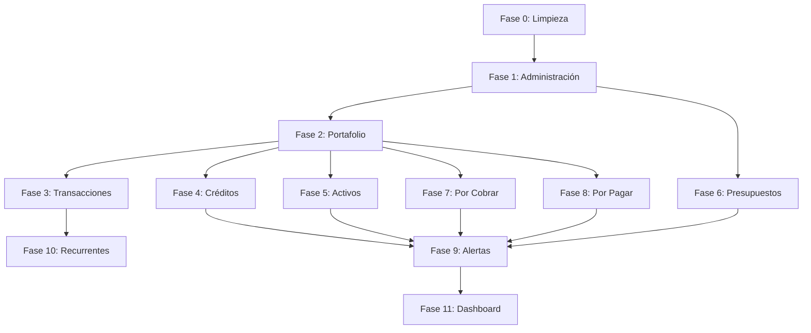

# Plan de Implementación: FinTrack PRD v3 — Reconstrucción Total

## Visión General

El usuario quiere que la app se reconstruya completamente según el PRD v3. Se trata de mantener la infraestructura (Next.js, Supabase, Tailwind, middleware, auth) y reconstruir TODOS los módulos funcionales desde cero según las especificaciones del documento.

---

## Auditoría: PRD v3 vs. Estado Actual

### Módulos del PRD v3 (11 módulos)

| # | Módulo PRD | Ruta actual | Estado actual | Acción |
|---|-----------|-------------|---------------|--------|
| 1 | Dashboard | `/dashboard` | Funcional parcial | **Reconstruir** - Nuevos widgets, panel derecho nuevo |
| 2 | Portafolio | `/portfolio` | Parcial (PortfolioManager) | **Reconstruir** - Filtros, vista lista/tarjetas |
| 3 | Transacciones | `/transactions` | Funcional parcial | **Reconstruir** - 6 tipos de operación, nuevos campos |
| 4 | Créditos | `/credits` | Parcial | **Reconstruir** - Tarjeta/Bancario, ciclos facturación, cronograma |
| 5 | Activos | `/assets` | Básico | **Reconstruir** - Nuevo flujo con tipos de activo |
| 6 | Presupuestos | `/budgets` | Básico | **Reconstruir** - Períodos, tracking de ejecución |
| 7 | Cuentas por Cobrar | `/receivables` | Básico | **Reconstruir** - Deudores, barra progreso |
| 8 | Cuentas por Pagar | `/payables` | Básico | **Reconstruir** - Acreedores, barra progreso |
| 9 | Alertas | `/alerts` | Básico | **Reconstruir** - 3 tipos (Crítica/Operativa/Sugerencia) |
| 10 | Administración | `/admin` | Parcial | **Reconstruir** - 4 secciones con CRUD completo |
| 11 | Trans. Recurrentes | *(no existe)* | No existe | **Crear desde cero** |

### Lo que NO está en PRD v3 (eliminar)

| Elemento | Ubicación | Acción |
|----------|-----------|--------|
| Settings/Configuración | `/settings`, `components/settings/*` | **Mantener** — confirmado por usuario |
| Design Review | `app/design-review/` | **Eliminar** |
| Landing Page | `app/LandingPage.tsx` | **Mantener** (entrada pública) |
| Mockups | `components/mockups/` | **Eliminar** |
| Nav item "Configuración" | `lib/constants/nav.ts` | **Mantener** |
| Módulo loans separado | `modules/loans/` | **Consolidar en Créditos** |
| Email templates | `supabase/email-templates/` | **Mantener** |
| NotificationsPanel | `components/settings/` | **Mover a Alertas** |

---

## Fases de Implementación

### Fase 0: Limpieza y Preparación
> [!IMPORTANT]
> Eliminar todo lo que no está en PRD, agregar la ruta de Transacciones Recurrentes

**Tareas:**
- [ ] Eliminar `app/design-review/`
- [ ] Eliminar `components/mockups/`
- [ ] **Mantener** `app/(dashboard)/settings/` y `components/settings/` (confirmado por usuario)
- [ ] Actualizar `nav.ts`: agregar "recurring" (Transacciones Recurrentes), mantener "settings"
- [ ] Actualizar `middleware.ts`: quitar `isDesignReviewRoute`
- [ ] Crear ruta `app/(dashboard)/recurring/page.tsx` (placeholder)
- [ ] Limpiar `Sidebar.tsx` y `LayoutIcons.tsx` si tienen referencia a settings/design-review

### Fase 1: Administración (Módulo 10)
> Fundación — todas las entidades maestras se crean aquí

**Tareas:**
- [ ] Reconstruir `AdminWorkspace.tsx` con 4 tabs: Entidad Bancaria, Moneda, Categoría, Tipo de Activo
- [ ] Reconstruir `BankEntitiesManager.tsx` según PRD (nombre, nombre corto, país, color, icono)
- [ ] Reconstruir `CurrenciesManager.tsx` según PRD (país + moneda del catálogo)
- [ ] Reconstruir `CategoriesManager.tsx` según PRD (nombre, tipo ingreso/egreso, color, icono)
- [ ] Reconstruir `AssetTypesManager.tsx` según PRD (defaults: Tecnología, Vehículo, Inmueble, Otro)
- [ ] Cada entidad: Editar, Eliminar (con restricción), Desactivar/Activar
- [ ] Server actions para CRUD de cada entidad

### Fase 2: Portafolio (Módulo 2)
> Depende de: Administración (entidad bancaria, moneda)

**Tareas:**
- [ ] Reconstruir `PortfolioManager.tsx`:
  - Resumen superior: cuentas activas/inactivas
  - Botón crear portafolio → modal con campos del PRD
  - Barra filtros (buscar, entidad bancaria, tipo, moneda, estado)
  - Iconos vista lista / vista tarjetas
  - Lista/tarjetas con: nombre, icono, entidad, tipo, moneda, saldo, estado
  - Acciones: editar, eliminar (sin transacciones), desactivar/activar
- [ ] Reconstruir `portfolio.repository.ts`
- [ ] Server actions para portafolio CRUD

### Fase 3: Transacciones (Módulo 3)
> Depende de: Portafolio, Administración, Presupuestos (parcial), Por Cobrar, Por Pagar

**Tareas:**
- [ ] Reconstruir `TransactionsWorkspace.tsx`:
  - Resumen superior: total egresos/ingresos/transferencias
  - 6 tipos de operación: Ingreso, Egreso, Transferencia, Compra de Activo, Cuentas por Pagar, Cuentas por Cobrar
  - Cada tipo con sus campos específicos según PRD
  - Botón "guardar como recurrente" en cada formulario
  - Adjuntar archivos
- [ ] Reconstruir `TransactionTable.tsx`:
  - Filtros: buscar, tipo, portafolio, categoría, fecha desde/hasta
  - Iconos color por tipo (rojo/verde/azul)
  - Acciones: editar, eliminar
- [ ] Reconstruir formularios de transacción
- [ ] Reconstruir server actions y repositorio

### Fase 4: Créditos (Módulo 4)
> Depende de: Portafolio, Administración

**Tareas:**
- [ ] Reconstruir `CreditsManager.tsx`:
  - Dos tipos: Tarjeta de Crédito y Crédito Bancario
  - **Tarjeta**: nombre, portafolio TC, entidad auto, línea, consumo, ciclos facturación
  - **Bancario**: nombre, entidad, cuenta destino, moneda auto, fechas, cuotas, cronograma
  - Filtros: buscar, tipo, estado, entidad
  - Vista lista / tarjetas
  - Barra progreso por crédito
  - Acciones: editar, eliminar (sin transacciones), desactivar/activar
  - Panel lateral de alertas de vencimientos
- [ ] Consolidar módulo `loans/` dentro de créditos
- [ ] Server actions para créditos CRUD + ciclos + cronograma

### Fase 5: Activos (Módulo 5) ✅
> Depende de: Portafolio, Administración

**Tareas:**
- [x] Reconstruir página de activos:
  - Resumen: activos activos y dados de baja
  - Crear activo = crear egreso + bien
  - Filtros: buscar, tipo activo, fecha desde/hasta
  - Vista lista / tarjetas por tipo
  - Acciones: editar, eliminar (con transacción), desactivar/activar
- [x] Reconstruir `asset.repository.ts`
- [x] Server actions (`/api/assets`, `/api/assets/[id]`, `/api/asset-types`)

### Fase 6: Presupuestos (Módulo 6) ✅
> Depende de: Administración (categorías)

**Tareas:**
- [x] Reconstruir `BudgetsManager.tsx`:
  - Crear: nombre, categoría, periodicidad, monto, moneda, fecha inicio, fecha fin auto
  - Períodos múltiples con continuidad automática
  - Ver transacciones por período
  - Filtros: buscar, moneda, categoría, estado
  - Vista lista / tarjetas
  - Acciones: editar, eliminar (sin transacciones), desactivar/activar
- [x] Server actions (`/api/budgets`, `/api/budgets/[id]`)

### Fase 7: Cuentas por Cobrar (Módulo 7)
> Depende de: Portafolio

**Tareas:**
- [ ] Reconstruir página:
  - Resumen: cobradas y pendientes
  - Crear registro = egreso (préstamo a deudor)
  - Crear deudor: nombre, deuda inicial, relación
  - Filtros: estado, ordenar por monto
  - Vista lista / tarjetas
  - Click en deudor → detalle con transacciones
  - Barra progreso por deudor
- [ ] Server actions para deudores y cuentas por cobrar

### Fase 8: Cuentas por Pagar (Módulo 8)
> Depende de: Portafolio

**Tareas:**
- [ ] Reconstruir página (espejo de Por Cobrar):
  - Resumen: pagadas y pendientes
  - Crear registro = ingreso (pago a acreedor)
  - Crear acreedor: nombre, deuda inicial, relación
  - Filtros: estado, ordenar por monto
  - Vista lista / tarjetas
  - Click en acreedor → detalle con transacciones
  - Barra progreso por acreedor
- [ ] Server actions para acreedores y cuentas por pagar

### Fase 9: Alertas (Módulo 9)
> Depende de: Todos los módulos

**Tareas:**
- [ ] Reconstruir `AlertsCenter.tsx`:
  - Resumen: leídas/pendientes por tipo (Críticas, Operativas, Sugerencias)
  - Filtros: tipo, estado, módulo
  - Lista ordenada por fecha (recientes primero)
  - Cada alerta: tipo con color, módulo, descripción, fecha, estado
  - Botón acción directa → navegar al registro origen
  - Generación automática según reglas del PRD

### Fase 10: Transacciones Recurrentes (Módulo 11) — NUEVO
> Depende de: Transacciones

**Tareas:**
- [ ] Crear módulo completo desde cero:
  - Resumen del total de recurrentes
  - Solo se crean desde Transacciones (no hay botón crear aquí)
  - Filtros: buscar, tipo operación, portafolio
  - Lista con: nombre, tipo (color), portafolio, monto, moneda
  - Acciones: Usar (pre-llena formulario), Editar, Eliminar
- [ ] Server actions para recurrentes CRUD

### Fase 11: Dashboard (Módulo 1)
> Depende de: Todos los módulos (datos consolidados)

**Tareas:**
- [ ] Reconstruir `DashboardClient.tsx` con todas las secciones del PRD:
  - **Panel central**: Balance consolidado + resultado mensual
  - **Money Flow 6 meses**: Gráfico línea con toggle acumulado
  - **Cards indicadores**: Ingresos/Egresos/Alertas del mes
  - **Saldos por día**: Gráfico con período seleccionable (5D/1M/3M/6M/1A)
  - **Métricas período**: 4 tarjetas (patrimonio, ingresos, egresos, balance)
  - **Resumen módulos**: 4 mini-tarjetas + expansión
  - **Panel derecho**: Saldos bancarios, Por Cobrar vs Pagar, Egresos por categoría, Vencimientos próximos, Presupuestos del mes, Créditos uso rápido
- [ ] Reconstruir `dashboard.service.ts`
- [ ] Server actions para dashboard

---

## Elementos Transversales (mantener/actualizar)

| Elemento | Acción |
|----------|--------|
| Auth (login/register) | **Mantener** |
| Middleware | **Mantener** (quitar design-review) |
| Supabase client/server | **Mantener** |
| Tailwind + design tokens | **Mantener** |
| Toast system | **Mantener** |
| Providers | **Mantener** |
| Theme toggle | **Mantener** |
| UI primitives (modals, selects, etc.) | **Mantener y extender** |
| Database schema (v2 migration) | **Mantener** — tablas ya creadas |
| Types (database.types.ts) | **Mantener** |
| File upload utilities | **Mantener** |
| Currency formatting | **Mantener** |

---

## Orden de Ejecución Recomendado

> [!WARNING]
> Este es un proyecto de gran escala. Cada fase incluye: database queries, server actions, repositorios, componentes UI, y estilos. Se recomienda implementar fase por fase, validando cada módulo antes de avanzar.

> [!IMPORTANT]
> ¿Quieres que empiece con **Fase 0 (Limpieza)** + **Fase 1 (Administración)** ahora?
